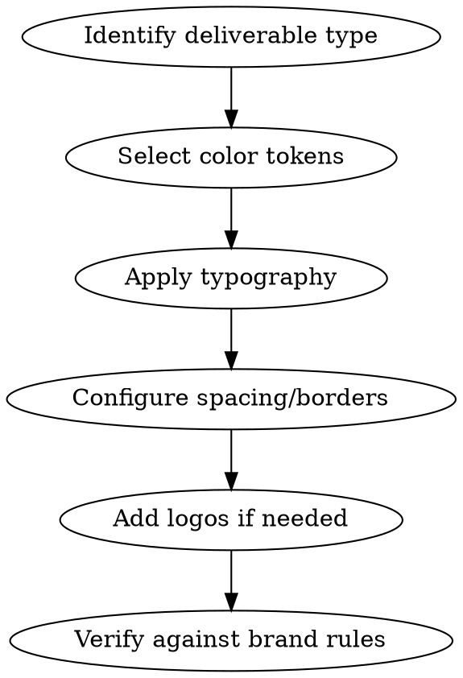

# Avincis Brand Design

Provides the complete Avincis corporate design system as portable tokens. Covers color system,
typography, spacing, diagram conventions, and logo usage.

## Workflow

### Step 1: Corporate Color System

Five corporate colors with full scales. Use the EXACT hex values below.

#### Avincis Blue (Primary)

| Scale | Hex       | RGB           | Usage                             |
| ----- | --------- | ------------- | --------------------------------- |
| 50    | `#F4F5F9` | 244, 245, 249 | Backgrounds, hover states         |
| 100   | `#E5E7F1` | 229, 231, 241 | Light backgrounds, cards          |
| 200   | `#C8CCE2` | 200, 204, 226 | Borders, dividers                 |
| 300   | `#A6ACCD` | 166, 172, 205 | Placeholder text, subtle elements |
| 400   | `#6E75A8` | 110, 117, 168 | Secondary text                    |
| 500   | `#4E5481` | 78, 84, 129   | Icons, medium emphasis            |
| 600   | `#3A3F66` | 58, 63, 102   | Strong text                       |
| 700   | `#2E3354` | 46, 51, 84    | Dark backgrounds                  |
| 800   | `#242846` | 36, 40, 70    | **PRIMARY** - Headers, dark bg    |
| 900   | `#1A1D34` | 26, 29, 52    | Deepest backgrounds               |
| 950   | `#0F1122` | 15, 17, 34    | Near black                        |

**Semantic mappings**: `--color-primary: blue.800`, `--color-primary-light: blue.100`,
`--color-primary-bg: blue.50`

#### Avincis Yellow (Accent)

| Scale | Hex       | RGB           | Usage                          |
| ----- | --------- | ------------- | ------------------------------ |
| 50    | `#FCF9F3` | 252, 249, 243 | Warm backgrounds               |
| 100   | `#FFF3D6` | 255, 243, 214 | Highlight backgrounds          |
| 200   | `#FFE799` | 255, 231, 153 | Light accent                   |
| 300   | `#FFD54F` | 255, 213, 79  | Medium accent                  |
| 400   | `#FFC100` | 255, 193, 0   | **PRIMARY** - CTAs, highlights |
| 500   | `#E6AE00` | 230, 174, 0   | Hover state                    |
| 600   | `#CC9A00` | 204, 154, 0   | Active state                   |
| 700   | `#997300` | 153, 115, 0   | Dark accent                    |
| 800   | `#664D00` | 102, 77, 0    | Very dark                      |
| 900   | `#332600` | 51, 38, 0     | Near black                     |
| 950   | `#1A1300` | 26, 19, 0     | Darkest                        |

**Semantic mappings**: `--color-accent: yellow.400`, `--color-accent-bg: yellow.50`,
`--color-warning: yellow.400`

#### Avincis Green (Success)

| Scale | Hex       | RGB           | Usage                              |
| ----- | --------- | ------------- | ---------------------------------- |
| 50    | `#F0FAF1` | 240, 250, 241 | Success backgrounds                |
| 100   | `#D1F0D5` | 209, 240, 213 | Light success                      |
| 200   | `#A3E1AB` | 163, 225, 171 | Medium success bg                  |
| 300   | `#5CC96A` | 92, 201, 106  | Success accents                    |
| 400   | `#2DB343` | 45, 179, 67   | Success hover                      |
| 500   | `#009638` | 0, 150, 56    | **PRIMARY** - Success, operational |
| 600   | `#007E2F` | 0, 126, 47    | Active state                       |
| 700   | `#006626` | 0, 102, 38    | Dark success                       |
| 800   | `#004D1C` | 0, 77, 28     | Very dark                          |
| 900   | `#003313` | 0, 51, 19     | Near black                         |
| 950   | `#001A09` | 0, 26, 9      | Darkest                            |

**Semantic mappings**: `--color-success: green.500`, `--color-success-bg: green.50`,
`--color-operational: green.500`

#### Avincis Red (Danger)

| Scale | Hex       | RGB           | Usage                              |
| ----- | --------- | ------------- | ---------------------------------- |
| 50    | `#FFF1EE` | 255, 241, 238 | Error backgrounds                  |
| 100   | `#FEDDDA` | 254, 221, 218 | Light error                        |
| 200   | `#FDBBAD` | 253, 187, 173 | Medium error bg                    |
| 300   | `#F58D76` | 245, 141, 118 | Error accents                      |
| 400   | `#EB4529` | 235, 69, 41   | **PRIMARY** - Error, EOL, critical |
| 500   | `#D33B22` | 211, 59, 34   | Error hover                        |
| 600   | `#B5321D` | 181, 50, 29   | Active state                       |
| 700   | `#8A2616` | 138, 38, 22   | Dark error                         |
| 800   | `#5F1A0F` | 95, 26, 15    | Very dark                          |
| 900   | `#340D08` | 52, 13, 8     | Near black                         |
| 950   | `#1A0704` | 26, 7, 4      | Darkest                            |

**Semantic mappings**: `--color-danger: red.400`, `--color-danger-bg: red.50`,
`--color-eol: red.400`

#### Avincis Sky (Auxiliary)

| Scale | Hex       | RGB           | Usage                              |
| ----- | --------- | ------------- | ---------------------------------- |
| 50    | `#F0F6FC` | 240, 246, 252 | Info backgrounds                   |
| 100   | `#E1EDF8` | 225, 237, 248 | Light info                         |
| 200   | `#C3DBF1` | 195, 219, 241 | Medium info bg                     |
| 300   | `#A5C9EA` | 165, 201, 234 | Info accents                       |
| 400   | `#90BAE4` | 144, 186, 228 | **PRIMARY** - Info, secondary blue |
| 500   | `#5D90C2` | 93, 144, 194  | Info hover                         |
| 600   | `#4A73A0` | 74, 115, 160  | Active state                       |
| 700   | `#38567E` | 56, 86, 126   | Dark info                          |
| 800   | `#253A5C` | 37, 58, 92    | Very dark                          |
| 900   | `#131D3A` | 19, 29, 58    | Near black                         |
| 950   | `#0A0F1D` | 10, 15, 29    | Darkest                            |

**Semantic mappings**: `--color-info: sky.400`, `--color-info-bg: sky.100`,
`--color-secondary-blue: sky.400`

#### Neutral (Slate)

| Scale | Hex       | RGB           | Usage                  |
| ----- | --------- | ------------- | ---------------------- |
| 50    | `#F8FAFC` | 248, 250, 252 | Page backgrounds       |
| 100   | `#F1F5F9` | 241, 245, 249 | Subtle backgrounds     |
| 200   | `#E2E8F0` | 226, 232, 240 | Borders, deprecated bg |
| 300   | `#CBD5E1` | 203, 213, 225 | Disabled elements      |
| 400   | `#94A3B8` | 148, 163, 184 | Placeholder, muted     |
| 500   | `#64748B` | 100, 116, 139 | Secondary text         |
| 600   | `#475569` | 71, 85, 105   | Body text              |
| 700   | `#334155` | 51, 65, 85    | Strong text            |
| 800   | `#1E293B` | 30, 41, 59    | Headings               |
| 900   | `#0F172A` | 15, 23, 42    | Near black             |
| 950   | `#020617` | 2, 6, 23      | True dark              |

**Semantic mappings**: `--color-text: slate.700`, `--color-text-muted: slate.500`,
`--color-border: slate.200`, `--color-deprecated: slate.400`

### Step 2: Typography

**Font families:**

| Role                    | Family       | Weight               | Fallback Stack                                                       |
| ----------------------- | ------------ | -------------------- | -------------------------------------------------------------------- |
| Primary (headings + UI) | Trebuchet MS | 400, 700             | `'Trebuchet MS', 'Lucida Grande', 'Lucida Sans Unicode', sans-serif` |
| Secondary (body text)   | Georgia      | 400, 400i            | `Georgia, 'Times New Roman', serif`                                  |
| Brand (Einforex)        | Prompt       | 400, 400i, 700, 700i | `Prompt, 'Trebuchet MS', sans-serif`                                 |

**Base sizes:**

| Element | Size | Line Height | Weight |
| ------- | ---- | ----------- | ------ |
| H1      | 28px | 1.3         | 700    |
| H2      | 22px | 1.35        | 700    |
| H3      | 18px | 1.4         | 700    |
| Body    | 14px | 1.6         | 400    |
| Small   | 12px | 1.5         | 400    |
| Caption | 10px | 1.4         | 400    |

**Font files available in `assets/fonts/`:**

| File                    | Format | Description                           |
| ----------------------- | ------ | ------------------------------------- |
| `fonts.css`             | CSS    | @font-face declarations for all fonts |
| `TrebuchetMS.woff`      | WOFF   | Primary font regular                  |
| `TrebuchetMS-Bold.woff` | WOFF   | Primary font bold                     |
| `Georgia.woff`          | WOFF   | Secondary font regular                |
| `Georgia-Italic.woff`   | WOFF   | Secondary font italic                 |
| `Prompt-Regular.woff2`  | WOFF2  | Einforex brand regular                |
| `Prompt-Bold.woff2`     | WOFF2  | Einforex brand bold                   |

### Step 3: Spacing, Radius, Borders

**Spacing scale:**

| Token         | Value | Usage             |
| ------------- | ----- | ----------------- |
| `--space-xs`  | 4px   | Tight padding     |
| `--space-sm`  | 8px   | Component padding |
| `--space-md`  | 16px  | Section padding   |
| `--space-lg`  | 24px  | Layout gaps       |
| `--space-xl`  | 32px  | Section spacing   |
| `--space-2xl` | 48px  | Page margins      |

**Border radius:**

| Token           | Value  | Usage           |
| --------------- | ------ | --------------- |
| `--radius-sm`   | 4px    | Buttons, inputs |
| `--radius-md`   | 8px    | Cards, panels   |
| `--radius-lg`   | 12px   | Modals, dialogs |
| `--radius-full` | 9999px | Pills, avatars  |

**Border widths:** 1px (default), 2px (emphasis), 3px (focus ring)

### Step 4: Draw.io / Diagrams Convention

Standardized color mapping for all diagram elements. Apply these tokens to every draw.io, PlantUML,
Mermaid, or SVG diagram.

**Element color mapping:**

| Element               | Fill                  | Stroke                 | Font Color            | Example            |
| --------------------- | --------------------- | ---------------------- | --------------------- | ------------------ |
| Host EOL / Stack EOL  | `red.50` (#FFF1EE)    | `red.400` (#EB4529)    | `red.400` (#EB4529)   | Ubuntu 16.04 nodes |
| Host supported        | `blue.100` (#E5E7F1)  | `blue.800` (#242846)   | `blue.800` (#242846)  | Debian 12 nodes    |
| App services          | `yellow.50` (#FCF9F3) | `yellow.400` (#FFC100) | `blue.800` (#242846)  | Java apps, Node.js |
| Infrastructure        | `green.50` (#F0FAF1)  | `green.500` (#009638)  | `blue.800` (#242846)  | NFS, Nagios        |
| Algorithms            | `sky.100` (#E1EDF8)   | `sky.500` (#5D90C2)    | `blue.800` (#242846)  | Processing nodes   |
| Deprecated            | `slate.200` (#E2E8F0) | `slate.400` (#94A3B8)  | `slate.400` (#94A3B8) | Unused services    |
| Boundary (provider)   | `blue.50` (#F4F5F9)   | `blue.800` (#242846)   | `blue.800` (#242846)  | Cloud providers    |
| Boundary (hypervisor) | `slate.50` (#F8FAFC)  | `slate.500` (#64748B)  | `slate.500` (#64748B) | vSphere, Proxmox   |
| Boundary (network)    | `green.50` (#F0FAF1)  | `green.500` (#009638)  | `green.500` (#009638) | VDC, VLAN          |
| Boundary (external)   | `yellow.50` (#FCF9F3) | `yellow.400` (#FFC100) | `blue.800` (#242846)  | CESGA, third party |

**UML shape conventions:**

| UML Element           | draw.io Shape                        | Key Style Props                              |
| --------------------- | ------------------------------------ | -------------------------------------------- |
| Device (physical/VM)  | `shape=cube;direction=south;size=10` | Container, **always** `strokeColor=blue.800` |
| Execution Environment | `shape=cube;direction=south;size=10` | Nested inside device, smaller                |
| Component/Artifact    | `shape=mxgraph.uml25.component`      | Inside device or exec env                    |
| App (simple)          | `rounded=1`                          | Rounded rectangle inside container           |

**Edge conventions:**

| Edge Type      | Style                      | strokeColor           | Width |
| -------------- | -------------------------- | --------------------- | ----- |
| Cluster sync   | `dashed=1;dashPattern=8 4` | `blue.300` (#A6ACCD)  | 2     |
| Dependency     | `endArrow=block;endFill=1` | `blue.800` (#242846)  | 1     |
| Technical debt | `dashed=1;dashPattern=4 2` | `red.400` (#EB4529)   | 2     |
| Deprecated     | `dashed=1;dashPattern=4 4` | `slate.400` (#94A3B8) | 1     |

**Global font:** `fontFamily=TrebuchetMS` (no space) on ALL elements. Draw.io requires the font name
without space. Labels use `fontColor=#242846` (blue.800) unless a semantic color applies.

**Device stroke rule:** ALL deployment targets (device nodes) use `strokeColor=#242846` (blue.800)
regardless of EOL status. The fill color communicates status (red.50 for EOL, blue.100 for
supported). This gives the diagram a cohesive Avincis identity.

### Step 5: Logo Usage

**Variants:**

| Variant     | File                     | Use When                                      |
| ----------- | ------------------------ | --------------------------------------------- |
| Blue logo   | `avincis-logo-blue.svg`  | Light backgrounds (white, blue.50, yellow.50) |
| White logo  | `avincis-logo-white.svg` | Dark backgrounds (blue.800, blue.900)         |
| Favicon SVG | `favicon.svg`            | Browser tabs, small icons                     |
| Favicon PNG | `favicon.png`            | Fallback for non-SVG contexts                 |

**Clear space:** Minimum 1x logo height around all sides.

**DON'T:** Stretch, rotate, recolor, place on busy backgrounds, use below 24px height.

### Step 6: Bundled Assets

Complete inventory of files shipped with this skill:

| Directory    | File                           | Size | Format | Purpose                   |
| ------------ | ------------------------------ | ---- | ------ | ------------------------- |
| `logos/`     | `avincis-logo-blue.svg`        | 2.5K | SVG    | Primary logo (light bg)   |
| `logos/`     | `avincis-logo-white.svg`       | 2.4K | SVG    | Inverted logo (dark bg)   |
| `logos/`     | `favicon.svg`                  | 1.0K | SVG    | Favicon (scalable)        |
| `logos/`     | `favicon.png`                  | 9.0K | PNG    | Favicon (raster fallback) |
| `fonts/`     | `fonts.css`                    | 1.4K | CSS    | @font-face declarations   |
| `fonts/`     | `TrebuchetMS.woff`             | 69K  | WOFF   | Primary font regular      |
| `fonts/`     | `TrebuchetMS-Bold.woff`        | 63K  | WOFF   | Primary font bold         |
| `fonts/`     | `Georgia.woff`                 | 146K | WOFF   | Secondary font regular    |
| `fonts/`     | `Georgia-Italic.woff`          | 154K | WOFF   | Secondary font italic     |
| `fonts/`     | `Prompt-Regular.woff2`         | 18K  | WOFF2  | Einforex brand regular    |
| `fonts/`     | `Prompt-Bold.woff2`            | 18K  | WOFF2  | Einforex brand bold       |
| `reference/` | `main-colors-variants.svg`     | 24K  | SVG    | All color scales visual   |
| `reference/` | `main-colors-combinations.svg` | 88K  | SVG    | Color pairing examples    |

**Total bundle:** ~594K

## Common Mistakes

| Mistake                           | Correct Approach                                            |
| --------------------------------- | ----------------------------------------------------------- |
| Using #0000CC for blue text       | Use `blue.800` (#242846)                                    |
| Using #CC0000 for red/error       | Use `red.400` (#EB4529)                                     |
| Using draw.io default colors      | Always use token hex values                                 |
| Mixing Arial with Trebuchet MS    | Use `TrebuchetMS` (no space) in draw.io                     |
| Using blue.800 on dark background | Switch to white logo variant                                |
| Hardcoding RGB instead of hex     | Always reference hex from token tables                      |
| Random spacing values             | Use spacing scale (4, 8, 16, 24, 32, 48)                    |
| Using `shape=mxgraph.uml25.node`  | Use `shape=cube;direction=south;size=10` for UML Deployment |
