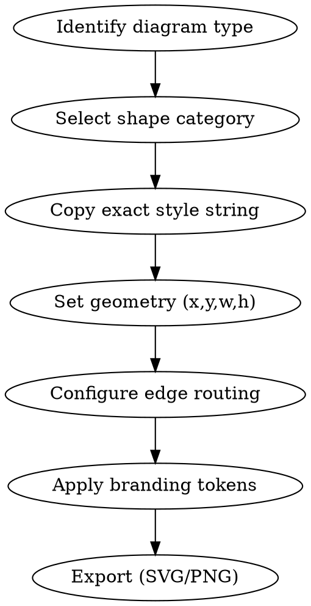

# Draw.io UML & AWS Shape Reference

**STATUS: DRAFT v0.1.0** - Verified against draw.io 24.x desktop. Style strings tested in
`build-einforex-diagrams.py` generating 15-tab architecture documentation.

Provides exact draw.io style strings for UML 2.5 deployment diagrams, AWS infrastructure groups,
edge routing, and Avincis corporate branding.

## Workflow



## 1. UML Deployment Target (Node)

The 3D cube representing a physical or virtual machine. **CORRECT** shape for UML deployment.

```
shape=cube;size=10;direction=south;boundedLbl=1;
verticalAlign=top;align=left;spacingLeft=5;
whiteSpace=wrap;html=1;recursiveResize=0;
fillColor=#E5E7F1;strokeColor=#242846;
strokeWidth=1;fontFamily=Trebuchet MS;fontSize=10;
fontColor=#242846;fontStyle=1;
```

**Key parameters:**

| Parameter | Value | Purpose |
|-----------|-------|---------|
| `shape=cube` | native | 3D cube with perspective (NOT `mxgraph.uml.node` which is flat) |
| `size=10` | pixels | Depth of the 3D face |
| `direction=south` | - | Top face visible (standard UML deployment view) |
| `boundedLbl=1` | boolean | Label stays within cube body |
| `recursiveResize=0` | boolean | Children don't auto-resize with parent |

**Variants:**

- **EOL/Critical**: `fillColor=#FFF1EE;strokeColor=#EB4529;fontColor=#EB4529;strokeWidth=2;`
- **OK/Standard**: `fillColor=#E5E7F1;strokeColor=#242846;fontColor=#242846;strokeWidth=1;`

**Common mistake**: Using `shape=mxgraph.uml.node` - this renders a flat rectangle with a small
3D tab, not a proper cube. Always use `shape=cube`.

## 2. UML Component

```
shape=mxgraph.uml.component;whiteSpace=wrap;html=1;
fillColor=#FFFFFF;strokeColor=#242846;
strokeWidth=1;fontFamily=Trebuchet MS;fontSize=9;
fontColor=#242846;verticalAlign=top;
```

This is correct as-is. The `mxgraph.uml.component` shape renders the standard UML component
notation with the two small rectangles on the left side.

**Variant - Critical/EOL:**
```
fillColor=#FFF1EE;strokeColor=#EB4529;strokeWidth=2;fontColor=#EB4529;fontStyle=1;
```

## 3. UML Artifact

```
shape=mxgraph.uml.artifact;whiteSpace=wrap;html=1;
fillColor=#FFFFFF;strokeColor=#242846;
fontFamily=Trebuchet MS;fontSize=8;fontColor=#242846;
```

Renders the standard UML artifact with the folded corner.

## 4. AWS Infrastructure Group Shapes

Hierarchical containment for infrastructure boundaries. These use the AWS4 shape library built
into draw.io.

### 4.1 Corporate Datacenter (Provider level)

For top-level providers like "R (Private Cloud)" or "CESGA".

```
shape=mxgraph.aws4.group;
grIcon=mxgraph.aws4.group_corporate_data_center;
verticalAlign=top;align=left;spacingLeft=30;
dashed=0;fillColor=none;strokeColor=#242846;
strokeWidth=2;
fontFamily=Trebuchet MS;fontSize=12;fontColor=#242846;
fontStyle=1;whiteSpace=wrap;html=1;
```

### 4.2 Region (IaaS/Hypervisor level)

For vSphere, OpenStack, or cloud regions.

```
shape=mxgraph.aws4.group;
grIcon=mxgraph.aws4.group_region;
verticalAlign=top;align=left;spacingLeft=30;
dashed=1;fillColor=none;strokeColor=#90BAE4;
strokeWidth=2;
fontFamily=Trebuchet MS;fontSize=11;fontColor=#242846;
fontStyle=1;whiteSpace=wrap;html=1;
```

### 4.3 VPC (Virtual Data Center)

For VDC or VPC boundaries.

```
shape=mxgraph.aws4.group;
grIcon=mxgraph.aws4.group_vpc;
verticalAlign=top;align=left;spacingLeft=30;
dashed=0;fillColor=none;strokeColor=#009638;
strokeWidth=2;
fontFamily=Trebuchet MS;fontSize=11;fontColor=#242846;
fontStyle=1;whiteSpace=wrap;html=1;
```

### 4.4 Security Group (Subnet/Segment)

For network segments or security zones.

```
shape=mxgraph.aws4.group;
grIcon=mxgraph.aws4.group_security_group;
verticalAlign=top;align=left;spacingLeft=30;
dashed=0;fillColor=#E6F6F712;strokeColor=#EB4529;
strokeWidth=1;
fontFamily=Trebuchet MS;fontSize=10;fontColor=#242846;
whiteSpace=wrap;html=1;
```

### 4.5 Corporate Datacenter - Critical/EOL

Red variant for boundaries highlighting problems.

```
shape=mxgraph.aws4.group;
grIcon=mxgraph.aws4.group_corporate_data_center;
verticalAlign=top;align=left;spacingLeft=30;
dashed=0;fillColor=#FFF1EE;strokeColor=#EB4529;
strokeWidth=2;
fontFamily=Trebuchet MS;fontSize=12;fontColor=#EB4529;
fontStyle=1;whiteSpace=wrap;html=1;
```

**Nesting hierarchy**: Provider > IaaS > VDC > Subnet

**Key parameter**: `spacingLeft=30` reserves space for the group icon.

## 5. Edge Routing

### 5.1 Orthogonal (RECOMMENDED DEFAULT)

All edges should use orthogonal routing for clean, professional diagrams.

```
edgeStyle=orthogonalEdgeStyle;rounded=0;
orthogonalLoop=1;jettySize=auto;html=1;
endArrow=open;endFill=0;
strokeColor=#242846;strokeWidth=1;
fontFamily=Trebuchet MS;fontSize=8;fontColor=#242846;
```

**Variants:**

| Variant | Arrow | Extra |
|---------|-------|-------|
| Default | `endArrow=open;endFill=0;` | Open arrowhead (UML dependency) |
| Directed flow | `endArrow=block;endFill=1;` | Filled arrowhead (data flow) |
| Dashed | add `dashed=1;` | Optional dependency |
| No arrow | `endArrow=none;` | Association |

### 5.2 Entity Relation

For ER diagrams or when you need curved connections.

```
edgeStyle=entityRelationEdgeStyle;rounded=1;
orthogonalLoop=1;jettySize=auto;html=1;
```

### 5.3 Isometric

For 3D/isometric diagrams.

```
edgeStyle=isometricEdgeStyle;elbow=vertical;
```

**Common mistake**: Omitting `edgeStyle=orthogonalEdgeStyle` produces straight-line edges that
cross over shapes. Always set an edgeStyle.

## 6. UML Sequence Diagram Elements

### Lifeline

```
shape=umlLifeline;perimeter=lifelinePerimeter;
whiteSpace=wrap;html=1;container=1;
dropTarget=0;collapsible=0;recursiveResize=0;
outlineConnect=0;portConstraint=eastwest;
size=40;
```

### Frame

```
shape=umlFrame;whiteSpace=wrap;html=1;
width=200;height=40;
```

### Activation Box

```
fillColor=#E5E7F1;strokeColor=#242846;
```

Place as child of lifeline with narrow width (10-15px).

## 7. UML State Machine

### State

```
rounded=1;arcSize=40;whiteSpace=wrap;html=1;
fillColor=#E5E7F1;strokeColor=#242846;
fontFamily=Trebuchet MS;fontSize=10;fontColor=#242846;
```

### Initial State (filled circle)

```
ellipse;html=1;shape=mxgraph.flowchart.start_2;
fillColor=#242846;strokeColor=#242846;
```

### Final State (bullseye)

```
ellipse;html=1;shape=doubleCircle;
fillColor=#242846;strokeColor=#242846;
```

## 8. UML Activity Diagram

### Swimlane

```
shape=swimlane;startSize=30;
fontFamily=Trebuchet MS;fontSize=11;fontColor=#242846;fontStyle=1;
fillColor=#E5E7F1;strokeColor=#242846;
```

### Decision (Diamond)

```
rhombus;whiteSpace=wrap;html=1;
fillColor=#FFC100;strokeColor=#242846;
fontFamily=Trebuchet MS;fontSize=9;fontColor=#242846;
```

## 9. UML Package

```
shape=folder;tabWidth=40;tabHeight=14;tabPosition=left;
whiteSpace=wrap;html=1;
fillColor=#E5E7F1;strokeColor=#242846;
fontFamily=Trebuchet MS;fontSize=11;fontColor=#242846;fontStyle=1;
```

## 10. UML Class Diagram

### Class Box (with compartments)

```
swimlane;fontStyle=1;align=center;startSize=26;
html=1;whiteSpace=wrap;
fillColor=#E5E7F1;strokeColor=#242846;
fontFamily=Trebuchet MS;fontSize=11;fontColor=#242846;
```

Compartment separator:

```
line;strokeWidth=1;fillColor=none;align=left;verticalAlign=middle;
spacingTop=-1;spacingLeft=3;spacingRight=10;rotatable=0;
labelPosition=left;points=[];portConstraint=eastwest;
strokeColor=#242846;
```

## 11. Avincis Branding Tokens

### Colors

| Token | Hex | Usage |
|-------|-----|-------|
| `C_BLUE` | `#242846` | Primary (strokes, text, dark fills) |
| `C_RED` | `#EB4529` | Critical, EOL, alerts |
| `C_YELLOW` | `#FFC100` | Warnings, gates, decisions |
| `C_GREEN` | `#009638` | Success, target, VPC boundaries |
| `C_BLUE_AUX` | `#90BAE4` | Secondary (dashed borders, regions) |
| `C_RED_FILL` | `#FFF1EE` | Light red background |
| `C_BLUE_FILL` | `#E5E7F1` | Light blue background |
| `C_WHITE` | `#FFFFFF` | Clean backgrounds |
| `C_GRAY` | `#999999` | Legends, secondary elements |
| `C_LIGHT_GRAY` | `#F5F5F5` | Subtle backgrounds |
| `C_ORANGE` | `#FF8C00` | High severity (not critical) |

### Typography

| Context | Font | Size |
|---------|------|------|
| Titles | Trebuchet MS | 16px, bold |
| Boundaries | Trebuchet MS | 11-12px, bold |
| Devices | Trebuchet MS | 10px, bold |
| Components | Trebuchet MS | 9px |
| Artifacts | Trebuchet MS | 8px |
| Edges | Trebuchet MS | 8px |
| Annotations | Trebuchet MS | 8-9px |

**Serif alternative**: Georgia (for formal documents, not diagrams).

## 12. Gotchas

### SVG Embedding

draw.io SVG exports embed fonts as `@font-face` references. If Trebuchet MS is not available
on the viewer's system, it falls back to the browser's sans-serif default.

**Mitigation**: When exporting for web embedding, add `fontFamily=Trebuchet MS,Helvetica,Arial,sans-serif;` to ensure graceful fallback.

### Compression

draw.io files can be saved compressed (deflate + base64) or uncompressed (raw XML). For
programmatic generation, always save uncompressed:

```python
tree = ET.ElementTree(mxfile)
ET.indent(tree, space="  ")
tree.write(filepath, encoding="UTF-8", xml_declaration=True)
```

### Cell ID Conventions

Use semantic, hyphenated IDs: `dep-fleetweb`, `ov-provider`, `cdc-e-wal`. This makes debugging
XML much easier than auto-generated IDs.

### Parent-Child Containment

When a cell has `parent="some-id"`, its geometry is **relative to the parent**. A device at
`x=20, y=40` inside a boundary at `x=380, y=230` appears at absolute position `(400, 270)`.

### Edge Routing with Nested Parents

Edges between cells in different parent boundaries may route unexpectedly. The `jettySize=auto`
parameter helps draw.io calculate optimal connection points.

### mxGraphModel Page Size

Default `pageWidth=1920;pageHeight=1080` works well for widescreen displays. For print-oriented
diagrams, use `pageWidth=1169;pageHeight=827` (A3 landscape).
