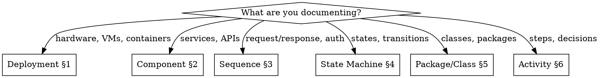

# Draw.io UML Shape Reference

Brand-agnostic UML shape reference for draw.io XML generation. Covers six UML diagram types
with correct shape-to-style mappings verified against draw.io 24.x desktop.

**Core principle:** Shapes encode UML semantics. Colors encode project semantics. Never mix them.

## When to use

- Generating or editing draw.io diagrams with UML notation
- Need correct draw.io shape names and style strings for UML elements
- Building diagram generators or templates programmatically
- Validating existing diagrams against UML standards

## When NOT to use

- Non-UML diagram types (ERD, BPMN, flowcharts, mind maps)
- Brand or styling decisions (load your project's brand skill instead)
- AWS/Azure/GCP infrastructure icons (use cloud-specific shape libraries)

## Companion file

See `shapes-reference.md` for the complete shape catalog with all style strings and XML examples.

## Supported diagram types

Deployment, Component, Sequence, State Machine, Package/Class, Activity.

## Semantic Color System

This skill uses a 3-layer architecture to separate UML semantics from visual branding:

```
Layer 3: Brand Override (optional) — your project's brand skill
Layer 2: Semantic Roles (this skill) — category-appserver, semantic-critical, etc.
Layer 1: Draw.io Style Strings (shapes-reference.md) — exact shape+color combos
```

Layer 1 defines the raw draw.io style properties. Layer 2 assigns meaningful names to
color combinations so diagrams communicate intent. Layer 3 lets any project override
the defaults with its own brand palette without touching diagram structure.

### Semantic role table

All defaults use the Tailwind Slate palette for a clean, neutral appearance.

| Role | Purpose | Default Fill | Default Stroke |
|------|---------|-------------|---------------|
| `surface-device` | Device backgrounds | `#F1F5F9` | `#475569` |
| `surface-default` | Artifacts, default fills | `#FFFFFF` | `#475569` |
| `surface-muted` | Subtle backgrounds | `#F8FAFC` | `#CBD5E1` |
| `text-primary` | Main text | — | `#1E293B` |
| `text-secondary` | Secondary text | — | `#475569` |
| `category-appserver` | App servers, JVMs, runtimes | `#FFFBEB` | `#D97706` |
| `category-database` | Database engines | `#EBF5FB` | `#2563EB` |
| `category-broker` | Message brokers | `#F5F3FF` | `#7C3AED` |
| `category-proxy` | Reverse proxies, LBs | `#F0FDF4` | `#16A34A` |
| `category-container` | Container runtimes | `#FFF7ED` | `#EA580C` |
| `category-infra` | Infra daemons, schedulers | `#F1F5F9` | `#64748B` |
| `semantic-critical` | EOL, alerts, failures | `#FEF2F2` | `#DC2626` |
| `semantic-warning` | Warnings, caution | `#FFFBEB` | `#D97706` |
| `semantic-success` | OK, healthy, target | `#F0FDF4` | `#16A34A` |
| `semantic-info` | Informational | `#EFF6FF` | `#2563EB` |
| `special-deployspec` | Deployment specifications | `#FEF3C7` | `#D97706` |
| `special-schema` | Database schemas | `#EBF5FB` | `#2563EB` |

### Typography defaults

- Font family: `Sans-serif` (brand layer overrides this)
- Font stack for SVG export: `Sans-serif, Helvetica, Arial, sans-serif`
- Typography scale:
  - Titles: 14-16px, bold (`fontStyle=1`)
  - Elements: 9-11px, regular
  - Details and edge labels: 7-8px

### Brand override mechanism

To apply your project's brand, load a brand skill that provides a mapping from semantic
roles to your brand's color tokens and font family. The brand skill overrides the defaults
above without modifying any diagram structure or UML shape selections.

A brand skill should provide a table mapping semantic roles to brand tokens:

| Semantic Role | Brand Token | Brand Value |
|---|---|---|
| `surface-device` | `brand.primary.bg` | `#yourcolor` |
| `text-primary` | `brand.primary.text` | `#yourcolor` |
| `semantic-critical` | `brand.danger.bg` | `#yourcolor` |
| `category-database` | `brand.accent.bg` | `#yourcolor` |

The brand skill replaces only `fillColor`, `strokeColor`, `fontColor`, and `fontFamily`
values. Shape names, geometry, and structural properties remain unchanged.

## Decision tree: which diagram?



| Intent | Diagram | Key Elements |
|--------|---------|-------------|
| Where does software run? | Deployment | Device, ExecutionEnvironment, Artifact |
| How do modules connect? | Component | Component, Interface, Port |
| How do actors interact over time? | Sequence | Lifeline, Message, Combined Fragment |
| What states does an entity traverse? | State Machine | State, Transition, Pseudostate |
| How is code organized? | Package/Class | Package, Class, Association |
| What steps form a process? | Activity | Action, Decision, Fork/Join |

## Quick reference by diagram type

### Deployment diagram

**Purpose:** Show where software artifacts run on physical or virtual infrastructure.

**Key elements:**

| Element | draw.io Shape | UML |
|---------|--------------|-----|
| Device | `shape=cube;direction=south;size=10` | 2.0+ |
| ExecutionEnvironment | `shape=mxgraph.uml.component` | 2.0+ |
| Artifact | `shape=mxgraph.uml.artifact` | 2.0+ |
| DeploymentSpec | `shape=mxgraph.uml.artifact` (italic) | 2.0+ |
| Database [custom] | `shape=cylinder3;size=8` | custom |
| Schema [custom] | `shape=mxgraph.uml.artifact` | custom |

**Containment rules:**

- Device can contain ExecutionEnvironment, Artifact, other Devices
- ExecutionEnvironment can contain Artifact, other ExecutionEnvironments
- Artifact can contain nested Artifacts
- DeploymentSpec attaches to Artifact (usually as sibling with dependency edge)
- Database is a Device variant (cylinder representation)
- Schema nests inside Database

See `shapes-reference.md` §1 for all style strings and XML examples.

### Component diagram

**Purpose:** Show logical modules, their interfaces, and dependencies.

**Key elements:**

| Element | draw.io Shape | UML |
|---------|--------------|-----|
| Component | `shape=mxgraph.uml.component` | 1.x+ |
| Subsystem | `shape=folder;tabWidth=80` | 2.0+ |
| Provided Interface | `ellipse` (16px) or edge `endArrow=oval` | 2.0+ |
| Required Interface | edge `endArrow=halfCircle` | 2.0+ |
| Port | `shape=mxgraph.uml.port` | 2.0+ |

**Containment rules:**

- Subsystem can contain Components and other Subsystems
- Component can contain other Components
- Port attaches to the boundary of a Component
- Provided Interface connects from a Port or Component boundary
- Required Interface connects to a Port or Component boundary

See `shapes-reference.md` §2 for all style strings and XML examples.

### Sequence diagram

**Purpose:** Show message flow between participants over time.

**Key elements:**

| Element | draw.io Shape | UML |
|---------|--------------|-----|
| Lifeline | `shape=umlLifeline` | 1.x+ |
| Synchronous Message | edge `endArrow=block;endFill=1` | 1.x+ |
| Asynchronous Message | edge `endArrow=open;endFill=0` | 1.x+ |
| Reply Message | edge `dashed=1;endArrow=open` | 1.x+ |
| Combined Fragment | `shape=umlFrame` | 2.0+ |
| Activation Box | thin rect on lifeline | 1.x+ |
| Destruction | `shape=umlDestroy` | 2.0+ |

**Containment rules:**

- Lifeline is a top-level participant (uses `container=1`)
- Activation Box is a child of Lifeline
- Messages connect between Lifelines or Activation Boxes
- Combined Fragment contains message sequences
- Destruction marker is placed at the end of a Lifeline

See `shapes-reference.md` §3 for all style strings and XML examples.

### State machine diagram

**Purpose:** Show the lifecycle states and transitions of an entity.

**Key elements:**

| Element | draw.io Shape | UML |
|---------|--------------|-----|
| Simple State | `rounded=1;arcSize=40` | 1.x+ |
| Initial Pseudostate | `ellipse` (filled, 20px) | 1.x+ |
| Final State | `shape=doubleCircle` | 1.x+ |
| Composite State | `swimlane;rounded=1` | 1.x+ |
| Choice | `rhombus` | 1.x+ |
| Fork/Join | filled bar (4px height) | 1.x+ |
| History (H/H*) | `ellipse` with label | 1.x+ |

**Containment rules:**

- Composite State can contain Simple States, pseudostates, and nested Composite States
- Initial Pseudostate must have exactly one outgoing transition
- Final State has no outgoing transitions
- Fork/Join bars split or merge concurrent transitions
- History pseudostates exist only inside Composite States

See `shapes-reference.md` §4 for all style strings and XML examples.

### Package/Class diagram

**Purpose:** Show code organization, class structure, and relationships.

**Key elements:**

| Element | draw.io Shape | UML |
|---------|--------------|-----|
| Package | `shape=folder;tabWidth=80` | 1.x+ |
| Class | `swimlane;startSize=26` | 1.x+ |
| Interface | `swimlane;startSize=40` (with stereotype) | 1.x+ |
| Generalization | edge `endArrow=block;endFill=0` | 1.x+ |
| Composition | edge `endArrow=diamond;endFill=1` | 1.x+ |
| Aggregation | edge `endArrow=diamond;endFill=0` | 1.x+ |
| Realization | edge `dashed=1;endArrow=block;endFill=0` | 1.x+ |

**Containment rules:**

- Package can contain Classes, Interfaces, and other Packages
- Class has compartments: name, attributes, methods (separated by `line` cells)
- Interface is a Class variant with `<<interface>>` stereotype
- Generalization, Composition, Aggregation are edges between Classes

See `shapes-reference.md` §5 for all style strings and XML examples.

### Activity diagram

**Purpose:** Show process workflows, decisions, and parallel execution.

**Key elements:**

| Element | draw.io Shape | UML |
|---------|--------------|-----|
| Action | `rounded=1;arcSize=20` | 2.0+ |
| Decision/Merge | `rhombus` | 1.x+ |
| Fork/Join | filled bar | 1.x+ |
| Initial | `ellipse` (filled, 20px) | 1.x+ |
| Final | `shape=doubleCircle` | 1.x+ |
| Swimlane | `shape=swimlane;startSize=30` | 1.x+ |
| Signal Send | `shape=mxgraph.uml25.sendSig` | 2.0+ |
| Signal Receive | `shape=mxgraph.uml25.recSig` | 2.0+ |

**Containment rules:**

- Swimlane contains Actions, Decisions, and other flow elements
- Fork/Join bars split or merge parallel flows
- Decision must have guards on all outgoing edges
- Merge combines alternative flows back into one

See `shapes-reference.md` §6 for all style strings and XML examples.

## Common elements

### Notes and constraints

Note shape:

```
shape=note;size=15;whiteSpace=wrap;html=1;fillColor=#FFFBEB;strokeColor=#D97706;fontFamily=Sans-serif;fontSize=8;fontColor=#1E293B;
```

Constraints use the note shape with `{constraint text}` format inside the label.

### Edge routing (default: orthogonal)

All edges should use orthogonal routing unless there is a specific reason not to.

```
edgeStyle=orthogonalEdgeStyle;rounded=0;orthogonalLoop=1;jettySize=auto;html=1;
```

### Edge types table

| Type | endArrow | endFill | dashed | UML Meaning |
|------|----------|---------|--------|-------------|
| Dependency | open | 0 | 1 | "uses" |
| Association | none | — | 0 | "connected to" |
| Directed association | open | 0 | 0 | navigable end |
| Generalization | block | 0 | 0 | "is-a" |
| Realization | block | 0 | 1 | "implements" |
| Composition | diamond | 1 | 0 | "owns" (lifecycle) |
| Aggregation | diamond | 0 | 0 | "has" (shared) |

### Edge label positioning

- `verticalAlign=bottom` for labels above the line
- `verticalAlign=top` for labels below the line
- Multiplicity labels use `align=left` or `align=right` at endpoints

## Definition of done

### Deployment DoD

- [ ] Every physical/virtual host is a `<<device>>` (cube)
- [ ] Software runtimes are `<<executionEnvironment>>` (component shape)
- [ ] Deployable units are `<<artifact>>` with correct nesting
- [ ] Database engines use `<<database>>` (cylinder)
- [ ] Color roles match element categories
- [ ] Parent-child geometry is relative to parent
- [ ] All edges use orthogonal routing

### Sequence DoD

- [ ] Every participant has a lifeline
- [ ] Messages use correct arrow types (sync=filled, async=open, reply=dashed)
- [ ] Combined fragments have operator labels (alt, loop, opt, etc.)
- [ ] Activation boxes span correct execution periods
- [ ] Lifelines use `container=1`

### State machine DoD

- [ ] Has exactly one initial pseudostate
- [ ] All terminal paths reach a final state or are documented as non-terminating
- [ ] Composite states have clear entry/exit transitions
- [ ] Transitions have `trigger [guard] / effect` labels
- [ ] Choice pseudostates have guards on all outgoing transitions

### Component DoD

- [ ] Components expose provided interfaces (lollipop)
- [ ] Dependencies shown as required interfaces (socket) or dashed arrows
- [ ] Subsystems group related components
- [ ] Ports shown where components cross boundaries

### Package/Class DoD

- [ ] Classes have attributes and methods in separate compartments
- [ ] Relationships use correct UML notation (composition ≠ aggregation)
- [ ] Abstract classes/interfaces have italic names or stereotypes
- [ ] Multiplicity labels present on associations

### Activity DoD

- [ ] Has exactly one initial node
- [ ] All terminal paths reach a final node or are documented as non-terminating
- [ ] Decision nodes have guards on all outgoing edges
- [ ] Fork/Join bars balance (every fork has a matching join)
- [ ] Swimlanes partition responsibilities clearly

## Validation checklist

Before considering a diagram complete, verify the following.

### Structure

- [ ] XML well-formed (`<mxGraphModel>` → `<root>` → cells)
- [ ] Cell 0 (root) and Cell 1 (default parent) present
- [ ] No orphaned cells (every cell has valid parent)
- [ ] Cell IDs are semantic and hyphenated (`dev-appserver`, not `cell-47`)

### Containment

- [ ] Parent-child relationships match UML containment rules
- [ ] Child geometry is relative to parent (NOT absolute)
- [ ] Container shapes have `recursiveResize=0` or `container=1` as appropriate

### Colors

- [ ] All fills/strokes use semantic role colors (no ad-hoc hex values)
- [ ] EOL/critical elements use `semantic-critical` role
- [ ] Category colors match element purpose

### Typography

- [ ] Font family is `Sans-serif` (or brand override)
- [ ] Font sizes follow scale: titles 14-16px, elements 9-11px, details 7-8px
- [ ] Bold (`fontStyle=1`) for container labels, regular for content

### Edges

- [ ] All edges have `edgeStyle=orthogonalEdgeStyle` (unless justified)
- [ ] Arrow types match UML semantics (see Common Elements)
- [ ] Labels positioned consistently

### Page

- [ ] Page dimensions set (`pageWidth=1920;pageHeight=1080` for screen, `1169x827` for A3)
- [ ] All shapes within page bounds

## Common mistakes

| Mistake | Fix |
|---------|-----|
| Using `shape=mxgraph.uml.node` for Device | Use `shape=cube;direction=south;size=10` |
| Using `shape=cube` for ExecutionEnvironment | Use `shape=mxgraph.uml.component` |
| Omitting `edgeStyle=orthogonalEdgeStyle` | Always set edgeStyle — bare edges cross shapes |
| Using `shape=mxgraph.uml25.component` | Use `shape=mxgraph.uml.component` (more reliable) |
| Hardcoding brand colors in style strings | Use semantic role defaults; brand skill overrides |
| Absolute geometry for nested cells | Child geometry is relative to parent |
| Missing `recursiveResize=0` on containers | Children auto-resize unexpectedly |
| Using `shape=ellipse` for final state | Use `shape=doubleCircle` for bullseye |
| Omitting `container=1` on lifelines | Activation boxes won't nest correctly |
| Using filled arrow for async messages | Async = open arrow (`endFill=0`), sync = filled (`endFill=1`) |
| Missing `dashed=1` on reply messages | Reply messages are ALWAYS dashed |
| Confusing aggregation and composition | Aggregation = hollow diamond, Composition = filled diamond |

## Gotchas

**SVG font fallback:** draw.io SVG exports reference fonts by name. If `Sans-serif` is
unavailable, the browser uses its default. For embedded SVGs, use the full stack:
`fontFamily=Sans-serif,Helvetica,Arial,sans-serif;`

**Compression:** draw.io saves compressed (deflate+base64) by default. For programmatic
generation, save uncompressed XML.

**Edge routing with nested parents:** Edges between cells in different parent containers
may route oddly. `jettySize=auto` helps calculate optimal connection points.

**Cell ID uniqueness:** IDs must be unique within the entire `<root>`. Use
`{diagram-prefix}-{element}` pattern (e.g., `dep-appserver`, `seq-user-lifeline`).

**Page size:** Default `1920x1080` fits widescreen. For print: `1169x827` (A3 landscape)
or `827x1169` (A3 portrait).

**HTML in labels:** Style strings with `html=1` expect HTML-encoded labels:
`&lt;b&gt;text&lt;/b&gt;` for bold, `&#xa;` for newlines.
