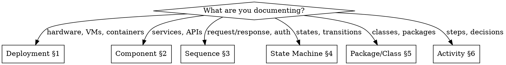

# Draw.io UML Shape Reference

Brand-agnostic UML shape reference for draw.io XML generation. Covers six UML diagram types with
correct shape-to-style mappings, verified by export against **draw.io Desktop 31.1.8**.

**Core principle:** Shapes encode UML semantics. Colors encode project semantics. Never mix them.

## Read this before generating anything

Four things were measured on 31.1.8 that contradict how this skill was written for 24.x. Each one
fails **silently** — the export succeeds and the result is wrong.

| Measured                                                              | Consequence                                           |
| --------------------------------------------------------------------- | ----------------------------------------------------- |
| `mxgraph.uml.*` stencils render as **plain rectangles** in CLI export | Use the native fallbacks below, not the stencil names |
| `--layout` applies to the **first page only**, ignoring `-p`          | Split multi-page files before laying out              |
| Pages are numbered **from 1** (0-based before v27.0.2)                | A 24.x script exports the wrong page                  |
| ELK destroys containers and ports; it helps flat graphs               | See `layout-reference.md` §1 before delegating layout |

### The stencil trap

Verified 2026-08-18 by exporting a probe with every catalogued shape. These six produce an
**unstyled rectangle** — no component tabs, no artifact fold, no signal pentagon:

`mxgraph.uml.component` · `mxgraph.uml.artifact` · `mxgraph.uml.node` · `mxgraph.uml.port` ·
`mxgraph.uml25.sendSig` · `mxgraph.uml25.recSig`

These render correctly and are what this skill now prefers:

`cube` · `cylinder3` · `doubleCircle` · `note` · `umlDestroy` · `folder` · `swimlane` ·
`umlLifeline` · `umlFrame` · `rounded` · `rhombus` · `ellipse`

**The fallback is not a workaround, it is valid UML.** The standard admits both the component symbol
and a plain rectangle carrying a `«component»` stereotype. Where a stencil fails, use a rectangle
plus the stereotype in the label — it survives export, and it reads the same.

Not yet distinguished: whether the stencils fail because shape libraries are not loaded in headless
export, or because the names changed. Until that is known, do not assume the app preview reflects
what the CLI will produce.

## When to use

- Generating or editing draw.io diagrams with UML notation
- Need correct draw.io shape names and style strings for UML elements
- Building diagram generators or templates programmatically
- Validating existing diagrams against UML standards

## When NOT to use

- Non-UML diagram types (ERD, BPMN, flowcharts, mind maps)
- Brand or styling decisions (load your project's brand skill instead)
- AWS/Azure/GCP infrastructure icons (use cloud-specific shape libraries)

## Companion files

- `shapes-reference.md` — complete shape catalog, all style strings and XML examples.
- `layout-reference.md` — when to delegate layout to ELK and when not, CLI traps, hand placement.
- `layouts/flow-down.json`, `layouts/flow-right.json` — calibrated layout profiles for `--layout`.
- `layouts/probes/` — the synthetic diagrams each profile was validated against. Re-export these
  after any draw.io upgrade and look at them.
- `dod-reference.md` — per-type DoD and the structural validation checklist.

## Supported diagram types

Deployment, Component, Sequence, State Machine, Package/Class, Activity.

## Semantic Color System

This skill uses a 3-layer architecture to separate UML semantics from visual branding:

```
Layer 3: Brand Override (optional) — your project's brand skill
Layer 2: Semantic Roles (this skill) — category-appserver, semantic-critical, etc.
Layer 1: Draw.io Style Strings (shapes-reference.md) — exact shape+color combos
```

Layer 1 defines the raw draw.io style properties. Layer 2 assigns meaningful names to color
combinations so diagrams communicate intent. Layer 3 lets any project override the defaults with its
own brand palette without touching diagram structure.

### Semantic role table

All defaults use the Tailwind Slate palette for a clean, neutral appearance.

| Role                 | Purpose                     | Default Fill | Default Stroke |
| -------------------- | --------------------------- | ------------ | -------------- |
| `surface-device`     | Device backgrounds          | `#F1F5F9`    | `#475569`      |
| `surface-default`    | Artifacts, default fills    | `#FFFFFF`    | `#475569`      |
| `surface-muted`      | Subtle backgrounds          | `#F8FAFC`    | `#CBD5E1`      |
| `text-primary`       | Main text                   | —            | `#1E293B`      |
| `text-secondary`     | Secondary text              | —            | `#475569`      |
| `category-appserver` | App servers, JVMs, runtimes | `#FFFBEB`    | `#D97706`      |
| `category-database`  | Database engines            | `#EBF5FB`    | `#2563EB`      |
| `category-broker`    | Message brokers             | `#F5F3FF`    | `#7C3AED`      |
| `category-proxy`     | Reverse proxies, LBs        | `#F0FDF4`    | `#16A34A`      |
| `category-container` | Container runtimes          | `#FFF7ED`    | `#EA580C`      |
| `category-infra`     | Infra daemons, schedulers   | `#F1F5F9`    | `#64748B`      |
| `semantic-critical`  | EOL, alerts, failures       | `#FEF2F2`    | `#DC2626`      |
| `semantic-warning`   | Warnings, caution           | `#FFFBEB`    | `#D97706`      |
| `semantic-success`   | OK, healthy, target         | `#F0FDF4`    | `#16A34A`      |
| `semantic-info`      | Informational               | `#EFF6FF`    | `#2563EB`      |
| `special-deployspec` | Deployment specifications   | `#FEF3C7`    | `#D97706`      |
| `special-schema`     | Database schemas            | `#EBF5FB`    | `#2563EB`      |

### Typography defaults

- Font family: `Sans-serif` (brand layer overrides this)
- Font stack for SVG export: `Sans-serif, Helvetica, Arial, sans-serif`
- Typography scale:
  - Titles: 14-16px, bold (`fontStyle=1`)
  - Elements: 9-11px, regular
  - Details and edge labels: 7-8px

### Embedding fonts offline

`fontFamily=X` alone falls back to the default face wherever X is not installed — CLI and PNG/SVG
exports on another machine included. Embed the whole family (every weight **and** italics) as a
`data:text/css` `fontSource`. Embed only the declared weights: `layout-reference.md` §5.

### Brand override mechanism

To apply your project's brand, load a brand skill that provides a mapping from semantic roles to
your brand's color tokens and font family. The brand skill overrides the defaults above without
modifying any diagram structure or UML shape selections.

A brand skill should provide a table mapping semantic roles to brand tokens:

| Semantic Role       | Brand Token          | Brand Value  |
| ------------------- | -------------------- | ------------ |
| `surface-device`    | `brand.primary.bg`   | `#yourcolor` |
| `text-primary`      | `brand.primary.text` | `#yourcolor` |
| `semantic-critical` | `brand.danger.bg`    | `#yourcolor` |
| `category-database` | `brand.accent.bg`    | `#yourcolor` |

The brand skill replaces only `fillColor`, `strokeColor`, `fontColor`, and `fontFamily` values.
Shape names, geometry, and structural properties remain unchanged.

## Decision tree: which diagram?


```dot
digraph which_diagram {
  rankdir=TB;
  "What are you documenting?" [shape=diamond];
  "Physical/virtual topology" [shape=box,label="Deployment §1"];
  "Logical modules and interfaces" [shape=box,label="Component §2"];
  "Message flow over time" [shape=box,label="Sequence §3"];
  "Entity lifecycle" [shape=box,label="State Machine §4"];
  "Code structure" [shape=box,label="Package/Class §5"];
  "Process workflow" [shape=box,label="Activity §6"];
  "What are you documenting?" -> "Physical/virtual topology" [label="hardware, VMs, containers"];
  "What are you documenting?" -> "Logical modules and interfaces" [label="services, APIs"];
  "What are you documenting?" -> "Message flow over time" [label="request/response, auth"];
  "What are you documenting?" -> "Entity lifecycle" [label="states, transitions"];
  "What are you documenting?" -> "Code structure" [label="classes, packages"];
  "What are you documenting?" -> "Process workflow" [label="steps, decisions"];
}
```

| Intent                               | Diagram       | Key Elements                           |
| ------------------------------------ | ------------- | -------------------------------------- |
| Where does software run?             | Deployment    | Device, ExecutionEnvironment, Artifact |
| How do modules connect?              | Component     | Component, Interface, Port             |
| How do actors interact over time?    | Sequence      | Lifeline, Message, Combined Fragment   |
| What states does an entity traverse? | State Machine | State, Transition, Pseudostate         |
| How is code organized?               | Package/Class | Package, Class, Association            |
| What steps form a process?           | Activity      | Action, Decision, Fork/Join            |

## Quick reference by diagram type

### Deployment diagram

**Purpose:** Show where software artifacts run on physical or virtual infrastructure.

**Key elements:**

| Element              | draw.io Shape                         | UML    |
| -------------------- | ------------------------------------- | ------ |
| Device               | `shape=cube;direction=south;size=10`  | 2.0+   |
| ExecutionEnvironment | rect + `«executionEnvironment»` label | 2.0+   |
| Artifact             | rect + `«artifact»` label             | 2.0+   |
| DeploymentSpec       | rect + `«deploymentSpec»` (italic)    | 2.0+   |
| Database [custom]    | `shape=cylinder3;size=8`              | custom |
| Schema [custom]      | rect + `«schema»` label               | custom |

**Containment rules:**

- Device can contain ExecutionEnvironment, Artifact, other Devices
- ExecutionEnvironment can contain Artifact, other ExecutionEnvironments
- Artifact can contain nested Artifacts
- DeploymentSpec attaches to Artifact (usually as sibling with dependency edge)
- Database is a Device variant (cylinder representation)
- Schema nests inside Database

See `shapes-reference.md` §1 for all style strings and XML examples.

### Component diagram

**Purpose:** Show logical modules, their interfaces, and dependencies.

**Key elements:**

| Element            | draw.io Shape                            | UML  |
| ------------------ | ---------------------------------------- | ---- |
| Component          | rect + `«component»` label               | 1.x+ |
| Subsystem          | `shape=folder;tabWidth=80`               | 2.0+ |
| Provided Interface | `ellipse` (16px) or edge `endArrow=oval` | 2.0+ |
| Required Interface | edge `endArrow=halfCircle`               | 2.0+ |
| Port               | small `rect` on the parent boundary      | 2.0+ |

**Containment rules:**

- Subsystem can contain Components and other Subsystems
- Component can contain other Components
- Port attaches to the boundary of a Component
- Provided Interface connects from a Port or Component boundary
- Required Interface connects to a Port or Component boundary

See `shapes-reference.md` §2 for all style strings and XML examples.

### Sequence diagram

**Purpose:** Show message flow between participants over time.

**Key elements:**

| Element              | draw.io Shape                   | UML  |
| -------------------- | ------------------------------- | ---- |
| Lifeline             | `shape=umlLifeline`             | 1.x+ |
| Synchronous Message  | edge `endArrow=block;endFill=1` | 1.x+ |
| Asynchronous Message | edge `endArrow=open;endFill=0`  | 1.x+ |
| Reply Message        | edge `dashed=1;endArrow=open`   | 1.x+ |
| Combined Fragment    | `shape=umlFrame`                | 2.0+ |
| Activation Box       | thin rect on lifeline           | 1.x+ |
| Destruction          | `shape=umlDestroy`              | 2.0+ |

**Containment rules:**

- Lifeline is a top-level participant (uses `container=1`)
- Activation Box is a child of Lifeline
- Messages connect between Lifelines or Activation Boxes
- Combined Fragment contains message sequences
- Destruction marker is placed at the end of a Lifeline

See `shapes-reference.md` §3 for all style strings and XML examples.

### State machine diagram

**Purpose:** Show the lifecycle states and transitions of an entity.

**Key elements:**

| Element             | draw.io Shape            | UML  |
| ------------------- | ------------------------ | ---- |
| Simple State        | `rounded=1;arcSize=40`   | 1.x+ |
| Initial Pseudostate | `ellipse` (filled, 20px) | 1.x+ |
| Final State         | `shape=doubleCircle`     | 1.x+ |
| Composite State     | `swimlane;rounded=1`     | 1.x+ |
| Choice              | `rhombus`                | 1.x+ |
| Fork/Join           | filled bar (4px height)  | 1.x+ |
| History (H/H\*)     | `ellipse` with label     | 1.x+ |

**Containment rules:**

- Composite State can contain Simple States, pseudostates, and nested Composite States
- Initial Pseudostate must have exactly one outgoing transition
- Final State has no outgoing transitions
- Fork/Join bars split or merge concurrent transitions
- History pseudostates exist only inside Composite States

See `shapes-reference.md` §4 for all style strings and XML examples.

### Package/Class diagram

**Purpose:** Show code organization, class structure, and relationships.

**Key elements:**

| Element        | draw.io Shape                             | UML  |
| -------------- | ----------------------------------------- | ---- |
| Package        | `shape=folder;tabWidth=80`                | 1.x+ |
| Class          | `swimlane;startSize=26`                   | 1.x+ |
| Interface      | `swimlane;startSize=40` (with stereotype) | 1.x+ |
| Generalization | edge `endArrow=block;endFill=0`           | 1.x+ |
| Composition    | edge `endArrow=diamond;endFill=1`         | 1.x+ |
| Aggregation    | edge `endArrow=diamond;endFill=0`         | 1.x+ |
| Realization    | edge `dashed=1;endArrow=block;endFill=0`  | 1.x+ |

**Containment rules:**

- Package can contain Classes, Interfaces, and other Packages
- Class has compartments: name, attributes, methods (separated by `line` cells)
- Interface is a Class variant with `<<interface>>` stereotype
- Generalization, Composition, Aggregation are edges between Classes

See `shapes-reference.md` §5 for all style strings and XML examples.

### Activity diagram

**Purpose:** Show process workflows, decisions, and parallel execution.

**Key elements:**

| Element        | draw.io Shape                        | UML  |
| -------------- | ------------------------------------ | ---- |
| Action         | `rounded=1;arcSize=20`               | 2.0+ |
| Decision/Merge | `rhombus`                            | 1.x+ |
| Fork/Join      | filled bar                           | 1.x+ |
| Initial        | `ellipse` (filled, 20px)             | 1.x+ |
| Final          | `shape=doubleCircle`                 | 1.x+ |
| Swimlane       | `shape=swimlane;startSize=30`        | 1.x+ |
| Signal Send    | `shape=step;perimeter=stepPerimeter` | 2.0+ |
| Signal Receive | `shape=step;direction=west`          | 2.0+ |

**Containment rules:**

- Swimlane contains Actions, Decisions, and other flow elements
- Fork/Join bars split or merge parallel flows
- Decision must have guards on all outgoing edges
- Merge combines alternative flows back into one

See `shapes-reference.md` §6 for all style strings and XML examples.

## Common elements

### Notes and constraints

Note shape:

```
shape=note;size=15;whiteSpace=wrap;html=1;fillColor=#FFFBEB;strokeColor=#D97706;fontFamily=Sans-serif;fontSize=8;fontColor=#1E293B;
```

Constraints use the note shape with `{constraint text}` format inside the label.

### Edge routing (default: orthogonal)

All edges should use orthogonal routing unless there is a specific reason not to.

```
edgeStyle=orthogonalEdgeStyle;rounded=0;orthogonalLoop=1;jettySize=auto;html=1;
```

### Edge crossing prevention (MANDATORY)

Edges MUST NOT visually intersect each other. Apply these strategies in order:

1. **Jump style on crossing edges:** Add `jumpStyle=arc;jumpSize=8;` to edges that must cross
   another. This renders a small arc where edges intersect, making the diagram readable.
2. **Layout order matters:** Place related shapes near each other to minimize edge lengths. Edges
   between adjacent elements rarely cross.
3. **Port positioning:** Use `exitX`, `exitY`, `entryX`, `entryY` to control which side of a shape
   an edge connects to. Distribute connection points to avoid bunching.
4. **Waypoints:** Add explicit waypoints (`Array<mxPoint>` in geometry) to route edges around
   obstacles when automatic routing fails.

```
# Edge with jump arcs for crossings:
edgeStyle=orthogonalEdgeStyle;rounded=0;orthogonalLoop=1;jettySize=auto;html=1;jumpStyle=arc;jumpSize=8;
```

**Rule of thumb:** If more than 2 edges cross at the same point, reorganize the layout. Edge jumps
are a fallback, not a substitute for good spatial arrangement.

### Tree / hierarchy layout — zero crossings by construction

For trees and strict hierarchies you can guarantee zero crossings **without** jump arcs: contiguous
subtree bands, plus one vertical bus per parent with pinned `exitX`/`entryX` and explicit waypoints.
Prefer it to `jumpStyle=arc` whenever the graph is a tree. Full method: `layout-reference.md` §1.

### Geometry on the grid

Keep the model on `gridSize`: sizes as grid multiples and every coordinate snapped; ≥2 cells of
separation; height derived from line count; width fitted per **column**, not per box; a small
**absolute** corner radius; `verticalAlign=middle` by default; and zero overlaps, verified
mechanically rather than by eye. Rules table: `layout-reference.md` §2.

### Edge types table

| Type                 | endArrow | endFill | dashed | UML Meaning        |
| -------------------- | -------- | ------- | ------ | ------------------ |
| Dependency           | open     | 0       | 1      | "uses"             |
| Association          | none     | —       | 0      | "connected to"     |
| Directed association | open     | 0       | 0      | navigable end      |
| Generalization       | block    | 0       | 0      | "is-a"             |
| Realization          | block    | 0       | 1      | "implements"       |
| Composition          | diamond  | 1       | 0      | "owns" (lifecycle) |
| Aggregation          | diamond  | 0       | 0      | "has" (shared)     |

### Edge label positioning

- `verticalAlign=bottom` for labels above the line
- `verticalAlign=top` for labels below the line
- Multiplicity labels use `align=left` or `align=right` at endpoints

## Definition of done and validation

Per-type DoD checklists (deployment, sequence, state machine, component, package/class, activity)
and the structural validation checklist live in `dod-reference.md`. Run them against a finished
diagram before calling it done.

## Common mistakes

| Mistake                                          | Fix                                                                                                                                                                                                                                                                                                                                                            |
| ------------------------------------------------ | -------------------------------------------------------------------------------------------------------------------------------------------------------------------------------------------------------------------------------------------------------------------------------------------------------------------------------------------------------------- |
| Using `shape=mxgraph.uml.node` for Device        | Use `shape=cube;direction=south;size=10`                                                                                                                                                                                                                                                                                                                       |
| Using `shape=cube` for ExecutionEnvironment      | Use a rect with an `«executionEnvironment»` label                                                                                                                                                                                                                                                                                                              |
| Omitting `edgeStyle=orthogonalEdgeStyle`         | Always set edgeStyle — bare edges cross shapes                                                                                                                                                                                                                                                                                                                 |
| Using any `mxgraph.uml.*` stencil                | Renders as a plain rectangle in CLI export — use the native fallback                                                                                                                                                                                                                                                                                           |
| Hardcoding brand colors in style strings         | Use semantic role defaults; brand skill overrides                                                                                                                                                                                                                                                                                                              |
| Absolute geometry for nested cells               | Child geometry is relative to parent                                                                                                                                                                                                                                                                                                                           |
| Missing `recursiveResize=0` on containers        | Children auto-resize unexpectedly                                                                                                                                                                                                                                                                                                                              |
| Missing `container=1` on grouping shapes         | Children not recognized as nested — breaks move/select                                                                                                                                                                                                                                                                                                         |
| Missing `collapsible=0` on UML containers        | User can accidentally collapse aggregate contents                                                                                                                                                                                                                                                                                                              |
| **Self-closing edges (no `<mxGeometry>` child)** | **Add `<mxGeometry relative="1" as="geometry" />` child to EVERY edge.** Self-closing edges (`<mxCell ... edge="1" ... />`) cause the "infinite scroll in corner" bug — draw.io opens the file with the viewport in an empty area far from the content. The edge must look like: `<mxCell ... edge="1" ...><mxGeometry relative="1" as="geometry" /></mxCell>` |
| Edges crossing without jump arcs                 | Add `jumpStyle=arc;jumpSize=8;` to crossing edges                                                                                                                                                                                                                                                                                                              |
| Using `shape=ellipse` for final state            | Use `shape=doubleCircle` for bullseye                                                                                                                                                                                                                                                                                                                          |
| Omitting `container=1` on lifelines              | Activation boxes won't nest correctly                                                                                                                                                                                                                                                                                                                          |
| Using filled arrow for async messages            | Async = open arrow (`endFill=0`), sync = filled (`endFill=1`)                                                                                                                                                                                                                                                                                                  |
| Missing `dashed=1` on reply messages             | Reply messages are ALWAYS dashed                                                                                                                                                                                                                                                                                                                               |
| Confusing aggregation and composition            | Aggregation = hollow diamond, Composition = filled diamond                                                                                                                                                                                                                                                                                                     |

## Gotchas

**SVG font fallback:** draw.io SVG exports reference fonts by name. If `Sans-serif` is unavailable,
the browser uses its default. For embedded SVGs, use the full stack:
`fontFamily=Sans-serif,Helvetica,Arial,sans-serif;`

**Compression:** draw.io saves compressed (deflate+base64) by default. For programmatic generation,
save uncompressed XML.

**Edge routing with nested parents:** Edges between cells in different parent containers may route
oddly. `jettySize=auto` helps calculate optimal connection points.

**Cell ID uniqueness:** IDs must be unique within the entire `<root>`. Use
`{diagram-prefix}-{element}` pattern (e.g., `dep-appserver`, `seq-user-lifeline`).

**Page size:** Default `1920x1080` fits widescreen. For print: `1169x827` (A3 landscape) or
`827x1169` (A3 portrait).

**HTML in labels:** Style strings with `html=1` expect HTML-encoded labels:
`&lt;b&gt;text&lt;/b&gt;` for bold, `&#xa;` for newlines.
