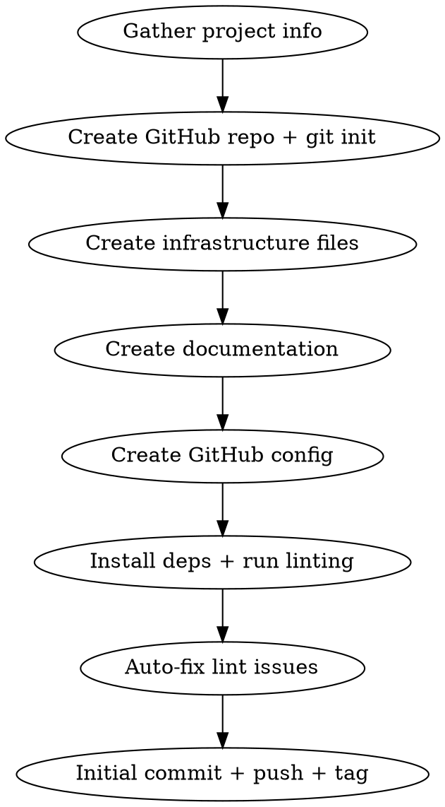

# Enterprise Repository Setup

Set up a professional OSS-grade repository with CI/CD, linting, releases, and documentation.

## Workflow



### Step 1: Gather Project Info

Ask the user (use AskUserQuestion):

| Parameter         | Required | Default |
| ----------------- | -------- | ------- |
| Project name      | Yes      | —       |
| Description       | Yes      | —       |
| GitHub owner/org  | Yes      | —       |
| GitHub visibility | No       | public  |
| License           | No       | MIT     |
| Tech stack        | No       | generic |

### Step 2: Create Repo + Git Init

```bash
mkdir -p /path/to/project
cd /path/to/project
git init
gh repo create owner/project-name --public \
  --description "..." --source=. --remote=origin
```

### Step 3: Create Files

**Directory structure:**

```
project/
├── .changelog-templates/     # Handlebars for auto-changelog
│   ├── template.hbs
│   ├── header.hbs
│   ├── commit.hbs
│   └── footer.hbs
├── .github/
│   ├── config/labels.json    # Label definitions for sync
│   ├── ISSUE_TEMPLATE/
│   │   ├── bug_report.md
│   │   └── feature_request.md
│   ├── PULL_REQUEST_TEMPLATE.md
│   ├── dependabot.yml
│   ├── scripts/
│   │   ├── ci/
│   │   │   ├── on-failure.sh   # Create issue on CI failure
│   │   │   └── on-success.sh   # Close issue on CI success
│   │   └── issues/
│   │       ├── create.sh
│   │       ├── search.sh
│   │       ├── close.sh
│   │       └── lib/common.sh   # Shared logging + label constants
│   └── workflows/
│       ├── ci.yml              # Main CI with auto-issue management
│       └── labels.yml          # Sync labels from labels.json
├── .editorconfig
├── .gitignore
├── .gitlint                    # Conventional commits enforcement
├── .markdownlint-cli2.jsonc    # Markdown lint config + ignores
├── .prettierrc
├── .prettierignore
├── .semver                     # Plain-text version (e.g., 0.1.0)
├── .versionrc.js               # commit-and-tag-version config
├── CHANGELOG.md
├── CODE_OF_CONDUCT.md          # Contributor Covenant 2.1
├── CONTRIBUTING.md
├── LICENSE
├── Makefile
├── README.md
├── ROADMAP.md
├── SECURITY.md
└── package.json                # Release + lint tooling only
```

### Step 4: Key Configuration Patterns

#### package.json (tooling only)

```json
{
  "private": true,
  "description": "Release and linting tooling for PROJECT",
  "scripts": {
    "release": "commit-and-tag-version --skip.commit --skip.tag",
    "release:dry-run": "commit-and-tag-version --dry-run",
    "lint:md": "markdownlint-cli2 '**/*.md'",
    "lint:md:fix": "markdownlint-cli2 --fix '**/*.md'",
    "format": "prettier --write '**/*.{md,json,yml,yaml}'",
    "format:check": "prettier --check '**/*.{md,json,yml,yaml}'"
  },
  "devDependencies": {
    "commit-and-tag-version": "^12.5.0",
    "markdownlint-cli2": "^0.17.0",
    "prettier": "^3.4.2"
  }
}
```

#### .markdownlint-cli2.jsonc

```jsonc
{
  "config": {
    "default": true,
    "MD013": false,
    "MD024": { "siblings_only": true },
    "MD033": false,
    "MD040": false,
    "MD041": false,
    "MD060": false,
  },
  "ignores": ["node_modules/**", "CHANGELOG.md", ".venv/**"],
}
```

#### .versionrc.js (key structure)

- `packageFiles`: Read version from `.semver` (plain-text)
- `bumpFiles`: `.semver` + `Makefile` (custom updater for `VERSION :=`)
- `writerOpts`: Load Handlebars templates from `.changelog-templates/`
- `types`: Map conventional commit types to changelog sections
- URLs: `commitUrlFormat`, `compareUrlFormat`, `issueUrlFormat` pointing to GitHub

#### .gitlint

```ini
[general]
contrib = contrib-title-conventional-commits
ignore-merge-commits = true
[title-max-length]
line-length = 72
[contrib-title-conventional-commits]
types = feat,fix,docs,style,refactor,test,chore,ci,perf,build,revert
```

### Step 5: CI Pattern (Self-Healing)

The CI workflow has 3 parallel lint jobs + a summary job with **auto-issue management**.

**Shell lint job:** Must use `severity: warning` to skip SC1091 (note-level, dynamic `source`
paths):

```yaml
- name: Run shellcheck
  uses: ludeeus/action-shellcheck@2.0.0
  with:
    scandir: '.github/scripts'
    severity: warning
```

**Auto-issue management:**

**On failure (main branch only):**

1. Each job has a corresponding `Handle X failure` step
2. Calls `.github/scripts/ci/on-failure.sh "job-name" "${RUN_URL}"`
3. Script checks for existing open issue (avoids duplicates)
4. Creates issue with labels: `ci-failure`, `automated`, `job:JOB_NAME`

**On success (main branch only):**

1. Each job has a corresponding `Handle X success` step
2. Calls `.github/scripts/ci/on-success.sh "job-name"`
3. Script searches for open issues with matching labels
4. Closes them with a resolution comment

**Security:** All GitHub context values in `run:` blocks MUST use `env:` variables, never direct
`${{ }}` interpolation. Only safe values (ref, server_url, repository, run_id, needs.\*.result) are
used.

**common.sh** defines: `REPO="owner/project"`, label constants, logging functions (`log_info`,
`log_error`, `log_success`, `log_warn`), and `check_prerequisites` (gh CLI + auth).

### Step 6: Makefile Convention

```makefile
SHELL := /bin/bash
.DEFAULT_GOAL := help
PROJECT_NAME := Project Name
VERSION := 0.1.0
```

**Target naming:** `verb/noun` — `lint/md`, `lint/shell`, `lint/md/fix`, `format/check`,
`release/patch`

**Colored output:** Use `tput` with fallback for non-terminal. Define `print_header`,
`print_success`, `print_error`, `print_warning`, `print_info` macros.

**Help target:** `grep -E` on `##` comments after targets.

**Lint targets:** `lint` (all), `lint/md`, `lint/md/fix`, `lint/shell` (shellcheck with
`--severity=warning -x`), `format`, `format/check`

**Release targets:** Run `npx commit-and-tag-version --skip.commit --skip.tag`, then manually
`git add`, `git commit`, `git tag`.

### Step 7: Linting Checklist

After creating all files:

1. `npm install`
2. `npx markdownlint-cli2 '**/*.md'` — fix issues with `--fix`
3. `shellcheck --severity=warning -x .github/scripts/**/*.sh`
4. `npx prettier --check '**/*.{md,json,yml,yaml}'` — fix with `--write`
5. Make shell scripts executable: `chmod +x .github/scripts/**/*.sh`

### Step 8: Initial Commit

```bash
git add [all files explicitly]
git commit -m "feat: initial project infrastructure

Enterprise OSS repository setup with CI/CD, linting, releases, and documentation.

Co-Authored-By: Claude Opus 4.6 <noreply@anthropic.com>"

git tag -a v0.1.0 -m "chore(release): v0.1.0"
git push -u origin main --tags
```

## Reference Repos

For exact file contents, read from the user's existing repos:

- `/Users/joserprieto/Projects/joserprieto/practice-desk` — Latest reference (full-stack)
- `/Users/joserprieto/Projects/joserprieto/ralphy-looper` — Python CLI reference
- `/Users/joserprieto/Projects/joserprieto/personal-site` — Monorepo (pnpm + turbo) reference

## Common Mistakes

| Mistake                                | Fix                                                                   |
| -------------------------------------- | --------------------------------------------------------------------- |
| markdownlint scans node_modules        | Use `.markdownlint-cli2.jsonc` with `ignores` array                   |
| shellcheck fails on dynamic `source`   | `--severity=warning` in Makefile AND `severity: warning` in CI action |
| prettier reformats CHANGELOG           | Add `CHANGELOG.md` to `.prettierignore`                               |
| CI workflow interpolates user input    | Always use `env:` variables, never direct `${{ }}` in `run:`          |
| commit-and-tag-version fails on commit | Use `--skip.commit --skip.tag`, then commit manually                  |
| `.semver` needs trailing newline       | Some tools strip it; configure `end-of-file-fixer` to exclude         |
