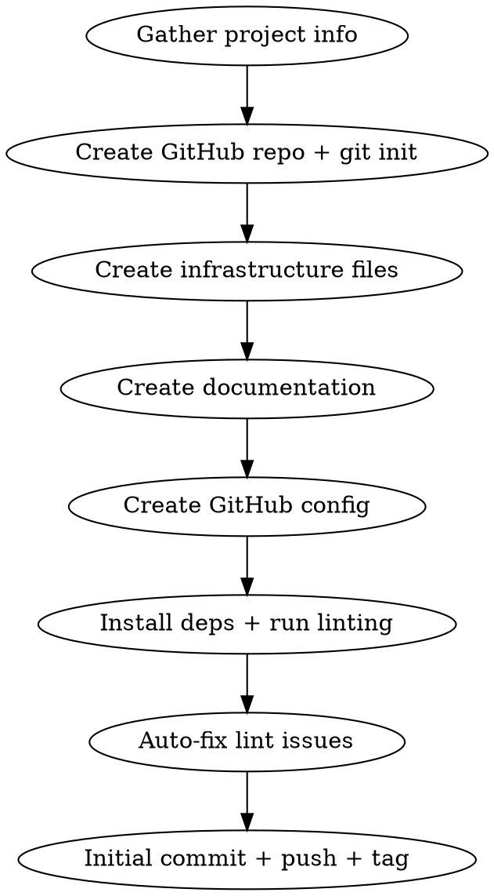

# Enterprise Repository Setup

Set up a professional OSS-grade repository with CI/CD, linting, releases, and documentation.

## Workflow


```dot
digraph setup {
  rankdir=TB;
  "Gather project info" -> "Create GitHub repo + git init";
  "Create GitHub repo + git init" -> "Create infrastructure files";
  "Create infrastructure files" -> "Create documentation";
  "Create documentation" -> "Create GitHub config";
  "Create GitHub config" -> "Install deps + run linting";
  "Install deps + run linting" -> "Auto-fix lint issues";
  "Auto-fix lint issues" -> "Initial commit + push + tag";
}
```

### Step 1: Gather Project Info

Ask the user (use AskUserQuestion):

| Parameter         | Required | Default          |
| ----------------- | -------- | ---------------- |
| Project name      | Yes      | —                |
| Description       | Yes      | —                |
| GitHub owner/org  | Yes      | —                |
| GitHub visibility | No       | public           |
| License           | No       | MIT              |
| Tech stack        | No       | generic          |
| Contact email     | Yes      | git author email |

**Contact email:** This is the public email shown in `CODE_OF_CONDUCT.md` and `SECURITY.md`. Suggest
the git author email as default (`git config user.email`). This email MUST be obfuscated in all
committed files to prevent scraping (see [Data Leak Prevention](#data-leak-prevention)).

### Step 2: Create Repo + Git Init

```bash
mkdir -p /path/to/project
cd /path/to/project
git init
gh repo create owner/project-name --public \
  --description "..." --source=. --remote=origin
```

### Step 3: Create Files

**Directory structure:**

```
project/
├── .changelog-templates/     # Handlebars for auto-changelog
│   ├── template.hbs
│   ├── header.hbs
│   ├── commit.hbs
│   └── footer.hbs
├── .github/
│   ├── config/labels.json    # Label definitions for sync
│   ├── ISSUE_TEMPLATE/
│   │   ├── bug_report.md
│   │   └── feature_request.md
│   ├── PULL_REQUEST_TEMPLATE.md
│   ├── dependabot.yml
│   ├── scripts/
│   │   ├── ci/
│   │   │   ├── on-failure.sh   # Create issue on CI failure
│   │   │   └── on-success.sh   # Close issue on CI success
│   │   └── issues/
│   │       ├── create.sh
│   │       ├── search.sh
│   │       ├── close.sh
│   │       └── lib/common.sh   # Shared logging + label constants
│   └── workflows/
│       ├── ci.yml              # Main CI with auto-issue management
│       └── labels.yml          # Sync labels from labels.json
├── .editorconfig
├── .gitignore
├── .gitlint                    # Conventional commits enforcement
├── .markdownlint-cli2.jsonc    # Markdown lint config + ignores
├── .prettierrc
├── .prettierignore
├── .semver                     # Plain-text version (e.g., 0.1.0)
├── .versionrc.js               # commit-and-tag-version config
├── CHANGELOG.md
├── .githooks/
│   └── pre-commit              # Personal data leak detection
├── CODE_OF_CONDUCT.md          # Contributor Covenant 2.1
├── CONTRIBUTING.md
├── LICENSE
├── Makefile
├── README.md
├── ROADMAP.md
├── SECURITY.md
└── package.json                # Release + lint tooling only
```

### Step 4: Key Configuration Patterns

#### package.json (tooling only)

```json
{
  "private": true,
  "description": "Release and linting tooling for PROJECT",
  "scripts": {
    "release": "commit-and-tag-version --skip.commit --skip.tag",
    "release:dry-run": "commit-and-tag-version --dry-run",
    "lint:md": "markdownlint-cli2 '**/*.md'",
    "lint:md:fix": "markdownlint-cli2 --fix '**/*.md'",
    "format": "prettier --write '**/*.{md,json,yml,yaml}'",
    "format:check": "prettier --check '**/*.{md,json,yml,yaml}'"
  },
  "devDependencies": {
    "commit-and-tag-version": "^12.5.0",
    "markdownlint-cli2": "^0.17.0",
    "prettier": "^3.4.2"
  }
}
```

#### .markdownlint-cli2.jsonc

```jsonc
{
  "config": {
    "default": true,
    "MD013": false,
    "MD024": { "siblings_only": true },
    "MD033": false,
    "MD040": false,
    "MD041": false,
    "MD060": false,
  },
  "ignores": ["node_modules/**", "CHANGELOG.md", ".venv/**"],
}
```

#### .versionrc.js (key structure)

- `packageFiles`: Read version from `.semver` (plain-text)
- `bumpFiles`: `.semver` + `Makefile` (custom updater for `VERSION :=`)
- `writerOpts`: Load Handlebars templates from `.changelog-templates/`
- `types`: Map conventional commit types to changelog sections
- URLs: `commitUrlFormat`, `compareUrlFormat`, `issueUrlFormat` pointing to GitHub

#### .gitlint

```ini
[general]
contrib = contrib-title-conventional-commits
ignore-merge-commits = true
[title-max-length]
line-length = 72
[contrib-title-conventional-commits]
types = feat,fix,docs,style,refactor,test,chore,ci,perf,build,revert
```

### Step 5: CI/CD — Self-Healing Pipeline

The CI system has 3 layers: **labels** (prerequisite), **issue management scripts** (reusable
library), and the **CI workflow** (orchestrator). All shell scripts use a shared library for logging
and constants.

#### 5.1 Labels (prerequisite for CI + dependabot)

Labels MUST exist in the GitHub repository BEFORE the CI workflow can tag issues or dependabot can
tag PRs. Define them in `.github/config/labels.json` and sync with a dedicated workflow.

**IMPORTANT:** If a label referenced by dependabot or CI scripts does not exist, it is silently
ignored — PRs/issues are created without labels, and search-by-label queries return no results
(breaking auto-close). Always run the labels sync workflow first.

##### `.github/config/labels.json`

```json
[
  { "name": "ci-failure", "color": "d73a4a", "description": "Automated CI failure issue" },
  { "name": "automated", "color": "0075ca", "description": "Created automatically by CI" },
  {
    "name": "job:lint-markdown",
    "color": "e4e669",
    "description": "Related to markdown lint CI job"
  },
  { "name": "job:lint-shell", "color": "e4e669", "description": "Related to shell lint CI job" },
  {
    "name": "job:format-check",
    "color": "e4e669",
    "description": "Related to format check CI job"
  },
  { "name": "bug", "color": "d73a4a", "description": "Something isn't working" },
  { "name": "enhancement", "color": "a2eeef", "description": "New feature or request" },
  {
    "name": "documentation",
    "color": "0075ca",
    "description": "Improvements or additions to documentation"
  },
  { "name": "good first issue", "color": "7057ff", "description": "Good for newcomers" },
  { "name": "question", "color": "d876e3", "description": "Further information is requested" },
  { "name": "dependencies", "color": "0366d6", "description": "Dependency updates" }
]
```

Adapt the `job:*` labels to match your CI job names. The `dependencies` label is required for
dependabot PRs (see [5.6 Dependabot](#56-dependabot)).

##### `.github/workflows/labels.yml`

```yaml
name: Sync Labels

on:
  push:
    branches: [main]
    paths:
      - '.github/config/labels.json'
  workflow_dispatch:

permissions:
  issues: write

jobs:
  sync:
    name: Sync Labels
    runs-on: ubuntu-latest
    steps:
      - name: Checkout code
        uses: actions/checkout@v6

      - name: Sync labels
        uses: EndBug/label-sync@v2
        with:
          config-file: .github/config/labels.json
          delete-other-labels: false
```

`delete-other-labels: false` preserves any manually created labels. Set to `true` for strict
label-as-code enforcement.

**First-time setup:** After the initial commit, either push to main (triggers the workflow) or run
it manually via `gh workflow run labels.yml`. Labels must be synced BEFORE the first CI failure or
dependabot PR.

#### 5.2 Issue Management Library

Scripts in `.github/scripts/issues/` provide reusable primitives for GitHub issue management.

##### `.github/scripts/issues/lib/common.sh`

```bash
#!/usr/bin/env bash
# Shared functions and constants for issue management scripts.
# Usage: source "$(dirname "${BASH_SOURCE[0]}")/lib/common.sh"

set -euo pipefail

# ── Color Configuration ───────────────────────────────────────────────
if [[ -t 1 ]]; then
    readonly COLOR_RED='\033[0;31m'
    readonly COLOR_GREEN='\033[0;32m'
    readonly COLOR_YELLOW='\033[0;33m'
    readonly COLOR_BLUE='\033[0;34m'
    readonly COLOR_RESET='\033[0m'
else
    readonly COLOR_RED=''
    readonly COLOR_GREEN=''
    readonly COLOR_YELLOW=''
    readonly COLOR_BLUE=''
    readonly COLOR_RESET=''
fi

# ── Logging ───────────────────────────────────────────────────────────
log_info()    { echo -e "${COLOR_BLUE}[INFO]${COLOR_RESET} $*" >&2; }
log_error()   { echo -e "${COLOR_RED}[ERROR]${COLOR_RESET} $*" >&2; }
log_success() { echo -e "${COLOR_GREEN}[OK]${COLOR_RESET} $*" >&2; }
log_warn()    { echo -e "${COLOR_YELLOW}[WARN]${COLOR_RESET} $*" >&2; }

# ── Label Constants ───────────────────────────────────────────────────
# shellcheck disable=SC2034
readonly LABEL_CI_FAILURE="ci-failure"
# shellcheck disable=SC2034
readonly LABEL_AUTOMATED="automated"

# Repository — CHANGE THIS to match your GitHub owner/repo
# shellcheck disable=SC2034
readonly REPO="OWNER/PROJECT"

# ── Validation ────────────────────────────────────────────────────────
validate_gh_auth() {
    if ! gh auth status &>/dev/null; then
        log_error "GitHub CLI is not authenticated."
        log_error "Set GH_TOKEN or GITHUB_TOKEN, or run 'gh auth login'."
        return 1
    fi
    log_info "GitHub CLI authentication verified."
}

require_gh_cli() {
    if ! command -v gh &>/dev/null; then
        log_error "'gh' CLI is not installed. See: https://cli.github.com/"
        return 1
    fi
}

check_prerequisites() {
    require_gh_cli
    validate_gh_auth
}
```

**IMPORTANT:** Replace `OWNER/PROJECT` in the `REPO` constant with the actual GitHub owner/repo.

##### `.github/scripts/issues/create.sh`

```bash
#!/usr/bin/env bash
# Creates a GitHub issue. Prints issue number to stdout.
# Usage: create.sh --title "..." --body "..." --labels "label1,label2"

set -euo pipefail

SCRIPT_DIR="$(cd "$(dirname "${BASH_SOURCE[0]}")" && pwd)"
# shellcheck source=lib/common.sh
source "${SCRIPT_DIR}/lib/common.sh"

TITLE="" BODY="" LABELS=""

while [[ $# -gt 0 ]]; do
    case "$1" in
        --title)  TITLE="$2";  shift 2 ;;
        --body)   BODY="$2";   shift 2 ;;
        --labels) LABELS="$2"; shift 2 ;;
        *) log_error "Unknown argument: $1"; exit 1 ;;
    esac
done

[[ -z "${TITLE}" ]] && { log_error "Missing --title"; exit 1; }
[[ -z "${BODY}" ]]  && { log_error "Missing --body"; exit 1; }

check_prerequisites

log_info "Creating issue: ${TITLE}"

GH_ARGS=(issue create --repo "${REPO}" --title "${TITLE}" --body "${BODY}")
[[ -n "${LABELS}" ]] && GH_ARGS+=(--label "${LABELS}")

ISSUE_URL="$(gh "${GH_ARGS[@]}")"
[[ -z "${ISSUE_URL}" ]] && { log_error "Failed to create issue."; exit 1; }

ISSUE_NUMBER="$(basename "${ISSUE_URL}")"
log_success "Issue #${ISSUE_NUMBER} created: ${ISSUE_URL}"
echo "${ISSUE_NUMBER}"
```

##### `.github/scripts/issues/search.sh`

```bash
#!/usr/bin/env bash
# Searches open issues by labels. Prints matching issue numbers (one per line).
# Usage: search.sh --labels "label1,label2"

set -euo pipefail

SCRIPT_DIR="$(cd "$(dirname "${BASH_SOURCE[0]}")" && pwd)"
# shellcheck source=lib/common.sh
source "${SCRIPT_DIR}/lib/common.sh"

LABELS=""

while [[ $# -gt 0 ]]; do
    case "$1" in
        --labels) LABELS="$2"; shift 2 ;;
        *) log_error "Unknown argument: $1"; exit 1 ;;
    esac
done

[[ -z "${LABELS}" ]] && { log_error "Missing --labels"; exit 1; }

check_prerequisites

log_info "Searching for open issues with labels: ${LABELS}"

RESULTS="$(gh issue list \
    --repo "${REPO}" \
    --label "${LABELS}" \
    --state open \
    --json number \
    --jq '.[].number' \
    2>/dev/null || true)"

if [[ -z "${RESULTS}" ]]; then
    log_info "No open issues found matching labels: ${LABELS}"
    exit 0
fi

COUNT="$(echo "${RESULTS}" | wc -l | tr -d ' ')"
log_info "Found ${COUNT} open issue(s) matching labels: ${LABELS}"
echo "${RESULTS}"
```

##### `.github/scripts/issues/close.sh`

```bash
#!/usr/bin/env bash
# Closes a GitHub issue with an optional comment.
# Usage: close.sh --issue <number> [--comment "..."]

set -euo pipefail

SCRIPT_DIR="$(cd "$(dirname "${BASH_SOURCE[0]}")" && pwd)"
# shellcheck source=lib/common.sh
source "${SCRIPT_DIR}/lib/common.sh"

ISSUE_NUMBER="" COMMENT=""

while [[ $# -gt 0 ]]; do
    case "$1" in
        --issue)   ISSUE_NUMBER="$2"; shift 2 ;;
        --comment) COMMENT="$2";      shift 2 ;;
        *) log_error "Unknown argument: $1"; exit 1 ;;
    esac
done

[[ -z "${ISSUE_NUMBER}" ]] && { log_error "Missing --issue"; exit 1; }
[[ ! "${ISSUE_NUMBER}" =~ ^[0-9]+$ ]] && { log_error "Issue number must be integer"; exit 1; }

check_prerequisites

if [[ -n "${COMMENT}" ]]; then
    log_info "Adding comment to issue #${ISSUE_NUMBER}..."
    gh issue comment "${ISSUE_NUMBER}" --repo "${REPO}" --body "${COMMENT}"
    log_success "Comment added to issue #${ISSUE_NUMBER}."
fi

log_info "Closing issue #${ISSUE_NUMBER}..."
gh issue close "${ISSUE_NUMBER}" --repo "${REPO}" --reason "completed"
log_success "Issue #${ISSUE_NUMBER} closed."
```

#### 5.3 CI Auto-Issue Scripts

These scripts wrap the issue library for CI-specific use cases. They are called from the CI workflow
(`ci-summary` job) on main-branch runs only.

##### `.github/scripts/ci/on-failure.sh`

```bash
#!/usr/bin/env bash
# Creates a GitHub issue when a CI job fails. Deduplicates (skips if open issue exists).
# Usage: on-failure.sh <job-name> <run-url>

set -euo pipefail

SCRIPT_DIR="$(cd "$(dirname "${BASH_SOURCE[0]}")" && pwd)"
ISSUES_DIR="${SCRIPT_DIR}/../issues"

# shellcheck source=../issues/lib/common.sh
source "${ISSUES_DIR}/lib/common.sh"

[[ $# -lt 2 ]] && { log_error "Usage: on-failure.sh <job-name> <run-url>"; exit 1; }

JOB_NAME="$1"
RUN_URL="$2"

COMMIT_SHA="${GITHUB_SHA:-unknown}"
ACTOR="${GITHUB_ACTOR:-unknown}"
BRANCH="${GITHUB_REF_NAME:-main}"

log_info "CI failure detected for job: ${JOB_NAME}"

TITLE="CI Failure: ${JOB_NAME} failed on ${BRANCH}"

BODY="## CI Job Failure

The **${JOB_NAME}** job failed on the **${BRANCH}** branch.

### Details

| Field | Value |
|-------|-------|
| **Job** | \`${JOB_NAME}\` |
| **Branch** | \`${BRANCH}\` |
| **Commit** | \`${COMMIT_SHA:0:8}\` |
| **Triggered by** | @${ACTOR} |
| **Run URL** | [View Logs](${RUN_URL}) |
| **Timestamp** | $(date -u '+%Y-%m-%d %H:%M:%S UTC') |

### Next Steps

1. Check the [workflow run logs](${RUN_URL}) for details
2. Fix the failing job
3. This issue will be **automatically closed** when the job passes on \`${BRANCH}\`

---
*This issue was automatically created by the CI pipeline.*"

LABELS="${LABEL_CI_FAILURE},${LABEL_AUTOMATED},job:${JOB_NAME}"

# ── Deduplication: skip if an open issue already exists ───────────────
EXISTING="$("${ISSUES_DIR}/search.sh" --labels "${LABELS}" 2>/dev/null || true)"

if [[ -n "${EXISTING}" ]]; then
    FIRST_ISSUE="$(echo "${EXISTING}" | head -n 1)"
    log_warn "Open CI failure issue already exists for '${JOB_NAME}': #${FIRST_ISSUE}"
    log_info "Skipping issue creation to avoid duplicates."
    exit 0
fi

ISSUE_NUMBER="$("${ISSUES_DIR}/create.sh" \
    --title "${TITLE}" \
    --body "${BODY}" \
    --labels "${LABELS}")"

log_success "Created CI failure issue #${ISSUE_NUMBER} for job '${JOB_NAME}'."
```

##### `.github/scripts/ci/on-success.sh`

```bash
#!/usr/bin/env bash
# Closes open CI failure issues when the job passes.
# Usage: on-success.sh <job-name>

set -euo pipefail

SCRIPT_DIR="$(cd "$(dirname "${BASH_SOURCE[0]}")" && pwd)"
ISSUES_DIR="${SCRIPT_DIR}/../issues"

# shellcheck source=../issues/lib/common.sh
source "${ISSUES_DIR}/lib/common.sh"

[[ $# -lt 1 ]] && { log_error "Usage: on-success.sh <job-name>"; exit 1; }

JOB_NAME="$1"

COMMIT_SHA="${GITHUB_SHA:-unknown}"
ACTOR="${GITHUB_ACTOR:-unknown}"
SERVER_URL="${GITHUB_SERVER_URL:-https://github.com}"
REPOSITORY="${GITHUB_REPOSITORY:-OWNER/PROJECT}"
RUN_ID="${GITHUB_RUN_ID:-}"

log_info "CI success for job: ${JOB_NAME} - checking for open failure issues..."

SEARCH_LABELS="${LABEL_CI_FAILURE},${LABEL_AUTOMATED},job:${JOB_NAME}"
ISSUE_NUMBERS="$("${ISSUES_DIR}/search.sh" --labels "${SEARCH_LABELS}" 2>/dev/null || true)"

if [[ -z "${ISSUE_NUMBERS}" ]]; then
    log_info "No open CI failure issues found for job '${JOB_NAME}'. Nothing to close."
    exit 0
fi

RUN_URL_PART=""
if [[ -n "${RUN_ID}" ]]; then
    RUN_URL_PART="
| **Passing run** | [View Logs](${SERVER_URL}/${REPOSITORY}/actions/runs/${RUN_ID}) |"
fi

COMMENT="## Resolved

The **${JOB_NAME}** job is now passing on the main branch.

| Field | Value |
|-------|-------|
| **Job** | \`${JOB_NAME}\` |
| **Fixed in commit** | \`${COMMIT_SHA:0:8}\` |
| **Fixed by** | @${ACTOR} |${RUN_URL_PART}
| **Resolved at** | $(date -u '+%Y-%m-%d %H:%M:%S UTC') |

---
*This issue was automatically closed by the CI pipeline.*"

CLOSED_COUNT=0

while IFS= read -r ISSUE_NUMBER; do
    [[ -z "${ISSUE_NUMBER}" ]] && continue

    log_info "Closing issue #${ISSUE_NUMBER}..."

    "${ISSUES_DIR}/close.sh" \
        --issue "${ISSUE_NUMBER}" \
        --comment "${COMMENT}" || {
            log_error "Failed to close issue #${ISSUE_NUMBER}. Continuing..."
            continue
        }

    CLOSED_COUNT=$((CLOSED_COUNT + 1))
done <<< "${ISSUE_NUMBERS}"

if [[ ${CLOSED_COUNT} -gt 0 ]]; then
    log_success "Closed ${CLOSED_COUNT} CI failure issue(s) for job '${JOB_NAME}'."
else
    log_warn "No issues were closed (all close attempts may have failed)."
fi
```

#### 5.4 CI Workflow

The workflow runs 3 parallel lint jobs + a `ci-summary` job that handles auto-issue management.

**Security:** All GitHub context values in `run:` blocks MUST use `env:` variables, never direct
`${{ }}` interpolation. Only safe values (ref, server_url, repository, run_id, needs.\*.result) are
used.

##### `.github/workflows/ci.yml`

```yaml
name: CI

on:
  push:
    branches: [main]
  pull_request:
    branches: [main]

concurrency:
  group: ci-${{ github.ref }}
  cancel-in-progress: true

permissions:
  contents: read
  issues: write

jobs:
  # ── Lint Markdown ─────────────────────────────────────────────────────
  lint-markdown:
    name: Markdown Lint
    runs-on: ubuntu-latest
    steps:
      - name: Checkout code
        uses: actions/checkout@v6

      - name: Run markdownlint
        uses: DavidAnson/markdownlint-cli2-action@v22
        with:
          globs: '**/*.md'
          fix: false

  # ── Lint Shell Scripts ────────────────────────────────────────────────
  lint-shell:
    name: Shell Lint
    runs-on: ubuntu-latest
    steps:
      - name: Checkout code
        uses: actions/checkout@v6

      - name: Run shellcheck
        uses: ludeeus/action-shellcheck@2.0.0
        with:
          scandir: '.github/scripts'
          severity: warning

  # ── Format Check ──────────────────────────────────────────────────────
  format-check:
    name: Format Check
    runs-on: ubuntu-latest
    steps:
      - name: Checkout code
        uses: actions/checkout@v6

      - name: Setup Node.js
        uses: actions/setup-node@v4
        with:
          node-version: '20'

      - name: Install dependencies
        run: npm ci

      - name: Check formatting
        run: npx prettier --check '**/*.{md,json,yml,yaml}'

  # ── CI Summary + Auto-Issue Management ────────────────────────────────
  ci-summary:
    name: CI Summary
    runs-on: ubuntu-latest
    if: always()
    needs: [lint-markdown, lint-shell, format-check]
    steps:
      - name: Checkout code
        uses: actions/checkout@v6

      - name: Make scripts executable
        run:
          chmod +x .github/scripts/ci/*.sh .github/scripts/issues/*.sh
          .github/scripts/issues/lib/*.sh

      - name: Determine overall result
        id: result
        env:
          LINT_MD_RESULT: ${{ needs.lint-markdown.result }}
          LINT_SHELL_RESULT: ${{ needs.lint-shell.result }}
          FORMAT_RESULT: ${{ needs.format-check.result }}
        run: |
          echo "lint-markdown=${LINT_MD_RESULT}" >> "$GITHUB_OUTPUT"
          echo "lint-shell=${LINT_SHELL_RESULT}" >> "$GITHUB_OUTPUT"
          echo "format-check=${FORMAT_RESULT}" >> "$GITHUB_OUTPUT"

          if [[ "${LINT_MD_RESULT}" == "success" && \
                "${LINT_SHELL_RESULT}" == "success" && \
                "${FORMAT_RESULT}" == "success" ]]; then
            echo "overall=success" >> "$GITHUB_OUTPUT"
          else
            echo "overall=failure" >> "$GITHUB_OUTPUT"
          fi

      - name: Print summary
        env:
          LINT_MD_RESULT: ${{ needs.lint-markdown.result }}
          LINT_SHELL_RESULT: ${{ needs.lint-shell.result }}
          FORMAT_RESULT: ${{ needs.format-check.result }}
          OVERALL_RESULT: ${{ steps.result.outputs.overall }}
        run: |
          echo "## CI Results" >> "$GITHUB_STEP_SUMMARY"
          echo "" >> "$GITHUB_STEP_SUMMARY"
          echo "| Job | Status |" >> "$GITHUB_STEP_SUMMARY"
          echo "|-----|--------|" >> "$GITHUB_STEP_SUMMARY"
          echo "| Markdown Lint | \`${LINT_MD_RESULT}\` |" >> "$GITHUB_STEP_SUMMARY"
          echo "| Shell Lint | \`${LINT_SHELL_RESULT}\` |" >> "$GITHUB_STEP_SUMMARY"
          echo "| Format Check | \`${FORMAT_RESULT}\` |" >> "$GITHUB_STEP_SUMMARY"
          echo "" >> "$GITHUB_STEP_SUMMARY"

          if [[ "${OVERALL_RESULT}" == "success" ]]; then
            echo "**Overall: All checks passed.**" >> "$GITHUB_STEP_SUMMARY"
          else
            echo "**Overall: One or more checks failed.**" >> "$GITHUB_STEP_SUMMARY"
          fi

      # ── Failure handling (main branch only) ───────────────────────────
      - name: Handle lint-markdown failure
        if: >-
          always() && github.ref == 'refs/heads/main' && needs.lint-markdown.result == 'failure'
        env:
          GH_TOKEN: ${{ secrets.GITHUB_TOKEN }}
          RUN_URL:
            ${{ github.server_url }}/${{ github.repository }}/actions/runs/${{ github.run_id }}
        run: .github/scripts/ci/on-failure.sh "lint-markdown" "${RUN_URL}"

      - name: Handle lint-shell failure
        if: >-
          always() && github.ref == 'refs/heads/main' && needs.lint-shell.result == 'failure'
        env:
          GH_TOKEN: ${{ secrets.GITHUB_TOKEN }}
          RUN_URL:
            ${{ github.server_url }}/${{ github.repository }}/actions/runs/${{ github.run_id }}
        run: .github/scripts/ci/on-failure.sh "lint-shell" "${RUN_URL}"

      - name: Handle format-check failure
        if: >-
          always() && github.ref == 'refs/heads/main' && needs.format-check.result == 'failure'
        env:
          GH_TOKEN: ${{ secrets.GITHUB_TOKEN }}
          RUN_URL:
            ${{ github.server_url }}/${{ github.repository }}/actions/runs/${{ github.run_id }}
        run: .github/scripts/ci/on-failure.sh "format-check" "${RUN_URL}"

      # ── Success handling (main branch only) ───────────────────────────
      - name: Handle lint-markdown success
        if: >-
          always() && github.ref == 'refs/heads/main' && needs.lint-markdown.result == 'success'
        env:
          GH_TOKEN: ${{ secrets.GITHUB_TOKEN }}
        run: .github/scripts/ci/on-success.sh "lint-markdown"

      - name: Handle lint-shell success
        if: >-
          always() && github.ref == 'refs/heads/main' && needs.lint-shell.result == 'success'
        env:
          GH_TOKEN: ${{ secrets.GITHUB_TOKEN }}
        run: .github/scripts/ci/on-success.sh "lint-shell"

      - name: Handle format-check success
        if: >-
          always() && github.ref == 'refs/heads/main' && needs.format-check.result == 'success'
        env:
          GH_TOKEN: ${{ secrets.GITHUB_TOKEN }}
        run: .github/scripts/ci/on-success.sh "format-check"

      # ── Final gate ────────────────────────────────────────────────────
      - name: Fail if any job failed
        if: always() && steps.result.outputs.overall == 'failure'
        run: |
          echo "::error::CI failed. See individual job results above."
          exit 1
```

**Key design decisions:**

- `concurrency` cancels in-progress runs on the same branch (saves CI minutes on rapid pushes)
- `permissions` requests only `contents: read` + `issues: write` (least privilege)
- `ci-summary` runs `if: always()` so it executes even when lint jobs fail
- Each failure/success handler has its own step with an `if:` condition — this way a failure in one
  handler doesn't block others
- `RUN_URL` is built from safe GitHub context values (`server_url`, `repository`, `run_id`)

**Shell lint:** Must use `severity: warning` to skip SC1091 (note-level, flagged on dynamic `source`
paths that shellcheck can't resolve statically).

#### 5.5 Adapting to Your Project

To add/remove CI jobs, follow this pattern:

1. Add the job to the `jobs:` section (parallel with others)
2. Add it to `ci-summary.needs: [...]`
3. Add env var + output in `Determine overall result` step
4. Add the env var to the `if` condition in `Determine overall result`
5. Add a row in `Print summary`
6. Add a `Handle X failure` step and a `Handle X success` step
7. Add a `job:your-job-name` label to `labels.json`

#### 5.6 Dependabot

Dependabot automates dependency update PRs. Configure it in `.github/dependabot.yml`.

##### `.github/dependabot.yml`

```yaml
version: 2
updates:
  - package-ecosystem: 'npm'
    directory: '/'
    schedule:
      interval: 'weekly'
    labels:
      - 'dependencies'
    commit-message:
      prefix: 'chore(deps)'

  - package-ecosystem: 'github-actions'
    directory: '/'
    schedule:
      interval: 'weekly'
    labels:
      - 'dependencies'
    commit-message:
      prefix: 'ci(deps)'
```

**Critical notes about dependabot `labels`:**

| Behavior                     | Detail                                                                                                                                       |
| ---------------------------- | -------------------------------------------------------------------------------------------------------------------------------------------- |
| Custom `labels` replaces ALL | Setting `labels: ['dependencies']` removes the default `dependencies` label, then re-adds your list. Use `labels: []` to disable ALL labels. |
| Labels MUST pre-exist        | If a label in the list doesn't exist in the repo, dependabot silently ignores it. The PR is created but without that label.                  |
| No auto-creation             | Unlike `gh issue create --label`, dependabot never creates missing labels.                                                                   |
| SemVer labels are separate   | Dependabot adds `major`/`minor`/`patch` labels automatically based on the version bump — these are unaffected by the `labels` option.        |

**`commit-message.prefix`** adds a conventional commit prefix to PR titles. Use `chore(deps)` for
runtime/dev dependencies and `ci(deps)` for GitHub Actions updates. This ensures dependabot PRs
follow the same commit convention as the rest of the project.

**Optional: Grouping updates** into a single PR per ecosystem:

```yaml
- package-ecosystem: 'npm'
  directory: '/'
  schedule:
    interval: 'weekly'
  labels:
    - 'dependencies'
  commit-message:
    prefix: 'chore(deps)'
  groups:
    all-npm:
      patterns:
        - '*'
```

### Step 6: Makefile Convention

```makefile
SHELL := /bin/bash
.DEFAULT_GOAL := help
PROJECT_NAME := Project Name
VERSION := 0.1.0
```

**Target naming:** `verb/noun` — `lint/md`, `lint/shell`, `lint/md/fix`, `format/check`,
`release/patch`

**Colored output:** Use `tput` with fallback for non-terminal. Define `print_header`,
`print_success`, `print_error`, `print_warning`, `print_info` macros.

**Help target:** `grep -E` on `##` comments after targets.

**Lint targets:** `lint` (all), `lint/md`, `lint/md/fix`, `lint/shell` (shellcheck with
`--severity=warning -x`), `format`, `format/check`

**Release targets:** Run `npx commit-and-tag-version --skip.commit --skip.tag`, then manually
`git add`, `git commit`, `git tag`.

### Step 7: Linting Checklist

After creating all files:

1. `npm install`
2. `npx markdownlint-cli2 '**/*.md'` — fix issues with `--fix`
3. `shellcheck --severity=warning -x .github/scripts/**/*.sh`
4. `npx prettier --check '**/*.{md,json,yml,yaml}'` — fix with `--write`
5. Make shell scripts executable: `chmod +x .github/scripts/**/*.sh`

### Step 8: Initial Commit

```bash
git add [all files explicitly]
git commit -m "feat: initial project infrastructure

Enterprise OSS repository setup with CI/CD, linting, releases, and documentation.

Co-Authored-By: Claude Opus 4.6 <noreply@anthropic.com>"

git tag -a v0.1.0 -m "chore(release): v0.1.0"
git push -u origin main --tags
```

## Reference Repos

For exact file contents, read from the user's existing repos:

- `/Users/joserprieto/Projects/joserprieto/practice-desk` — Latest reference (full-stack)
- `/Users/joserprieto/Projects/joserprieto/ralphy-looper` — Python CLI reference
- `/Users/joserprieto/Projects/joserprieto/personal-site` — Monorepo (pnpm + turbo) reference

## Data Leak Prevention

OSS repos MUST NOT contain personal data beyond the designated contact email.

### Email Obfuscation

In `CODE_OF_CONDUCT.md` and `SECURITY.md`, ALWAYS obfuscate emails to prevent automated scraping:

```markdown
<!-- GOOD — anti-scraping format -->

**hi [at] example [dot] com**

<!-- BAD — trivially scrapeable -->

hi@example.com <a href="mailto:hi@example.com">
```

The contact email SHOULD be the same as the git author email. Ask the user during setup (Step 1).

### Pre-commit Hook: Personal Data Detection

Create `.githooks/pre-commit` to scan staged files for accidental personal data leaks:

```bash
#!/bin/sh
# Pre-commit hook: detect personal data leaks in staged files
set -eu

# ── Configurable patterns ──────────────────────────────────────────────
# Add literal strings that must NEVER appear in committed files.
# One pattern per line. Lines starting with # are comments.
DENY_PATTERNS_FILE=".githooks/deny-patterns.txt"

# ── Fallback built-in patterns ─────────────────────────────────────────
# If no deny-patterns file exists, scan for common leak indicators.
BUILTIN_PATTERNS='@gmail\.com
@hotmail\.com
@yahoo\.com
@outlook\.com
/Users/[a-zA-Z]
/home/[a-zA-Z]
C:\\Users\\'

# ── Scan ───────────────────────────────────────────────────────────────
fail=0

if [ -f "$DENY_PATTERNS_FILE" ]; then
    patterns=$(grep -v '^\s*#' "$DENY_PATTERNS_FILE" | grep -v '^\s*$' || true)
else
    patterns="$BUILTIN_PATTERNS"
fi

if [ -z "$patterns" ]; then
    exit 0
fi

staged_files=$(git diff --cached --name-only --diff-filter=ACM)
[ -z "$staged_files" ] && exit 0

# NOTE: Use here-doc (not pipe) so the while loop runs in the current
# shell — variables set inside (fail=1) survive after the loop.
while IFS= read -r pat; do
    [ -z "$pat" ] && continue
    # shellcheck disable=SC2086
    matches=$(echo "$staged_files" | xargs grep -lnE "$pat" 2>/dev/null || true)
    if [ -n "$matches" ]; then
        printf '\033[31mLEAK DETECTED\033[0m pattern: %s\n' "$pat"
        echo "$matches" | while IFS= read -r file; do
            printf '  → %s\n' "$file"
        done
        fail=1
    fi
done <<EOF
$patterns
EOF

if [ "$fail" -ne 0 ]; then
    printf '\n\033[31mCommit blocked.\033[0m Remove personal data from staged files.\n'
    printf 'If this is a false positive, add an exception to %s\n' "$DENY_PATTERNS_FILE"
    exit 1
fi
```

Create `.githooks/deny-patterns.txt` with project-specific patterns:

```text
# Personal data patterns — one regex per line
# These patterns are checked against ALL staged files on every commit.
#
# Add your personal email domains, usernames, home directory paths, etc.
# Example:
# @personal-domain\.com
# /Users/myname
# /home/myname
```

**Hook installation** (add to Makefile `install` target or document in CONTRIBUTING.md):

```bash
git config core.hooksPath .githooks
```

### History Purge Checklist

If personal data has already been committed, removing it from tracked files is NOT enough — it
remains in git history. Use `git filter-repo` to rewrite history:

```bash
# 1. Backup
git clone --mirror origin-url backup.git

# 2. Purge paths containing personal data
git filter-repo --invert-paths --path docs/plans/ --path secrets/

# 3. Force push (DESTRUCTIVE — coordinate with collaborators)
git remote add origin <url>
git push --force --all
git push --force --tags

# 4. All collaborators must re-clone (rebase won't work after filter-repo)
```

**IMPORTANT:** `git filter-repo` removes the `origin` remote as a safety measure. You must re-add it
manually after the rewrite.

### Empty Directory Tracking: .gitignore > .gitkeep

**ALWAYS use `.gitignore` files instead of `.gitkeep` to track empty directories.** The `.gitignore`
pattern is strictly superior:

```gitignore
# .gitignore inside the empty directory (e.g., .keys/age/.gitignore)
*
!.gitignore
```

**Why this is better than `.gitkeep`:**

| Aspect                      | `.gitkeep`                            | `.gitignore` pattern                      |
| --------------------------- | ------------------------------------- | ----------------------------------------- |
| Prevents accidental commits | No — any file can be added            | Yes — `*` blocks all files                |
| Self-documenting            | No — empty file with no semantics     | Yes — explicitly declares intent          |
| Orphan risk                 | High — `.gitkeep` files get forgotten | None — `.gitignore` is self-contained     |
| Subdirectory support        | No — just tracks the directory        | Yes — use `!subdir` to whitelist children |

**For sensitive directories** (keys, secrets), the `.gitignore` pattern actively protects against
accidental commits of private material. A `.gitkeep` provides zero protection.

**Example for a keys directory:**

```
.keys/
├── .gitignore          # * / !.gitignore / !age
└── age/
    └── .gitignore      # * / !.gitignore
```

### .gitignore Patterns for Sensitive Directories

Always include these in `.gitignore` for directories that may contain personal notes or local plans:

```gitignore
# Local-only documents (may contain personal data)
docs/plans/
*.local
*.local.*
.env.local
```

## Common Mistakes

| Mistake                                | Fix                                                                   |
| -------------------------------------- | --------------------------------------------------------------------- |
| markdownlint scans node_modules        | Use `.markdownlint-cli2.jsonc` with `ignores` array                   |
| shellcheck fails on dynamic `source`   | `--severity=warning` in Makefile AND `severity: warning` in CI action |
| prettier reformats CHANGELOG           | Add `CHANGELOG.md` to `.prettierignore`                               |
| CI workflow interpolates user input    | Always use `env:` variables, never direct `${{ }}` in `run:`          |
| commit-and-tag-version fails on commit | Use `--skip.commit --skip.tag`, then commit manually                  |
| `.semver` needs trailing newline       | Some tools strip it; configure `end-of-file-fixer` to exclude         |
| Personal email in CODE_OF_CONDUCT      | Use obfuscated format: `hi [at] example [dot] com`                    |
| Personal data in git history           | `git rm` only removes from HEAD; use `git filter-repo` to purge       |
| Personal paths in examples             | Use generic paths (`~/Projects/...`) not real usernames               |
| Squash doesn't purge history           | Squash only rewrites HEAD chain; old refs survive in reflog/remotes   |
| `.gitkeep` for empty directories       | Use `.gitignore` with `*` + `!.gitignore` — protects against leaks    |
| Dependabot PRs have no labels          | Labels must pre-exist in the repo; sync `labels.json` first           |
| CI auto-close doesn't find issues      | Missing `job:*` labels; run labels sync workflow before first CI run  |
