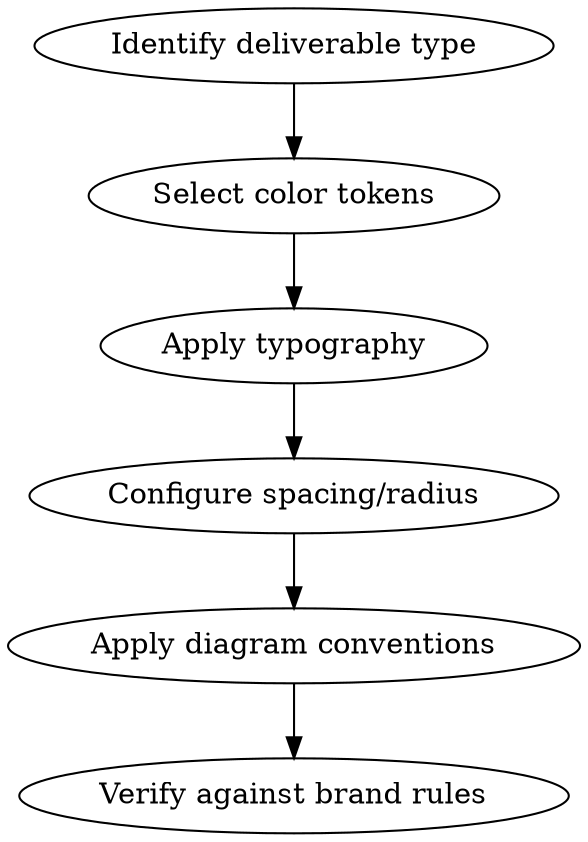

# joserprieto Brand Design

Complete joserprieto personal brand design system as portable tokens. Covers all color palettes
(OKHSL-generated), typography, spacing, radius, diagram conventions, logo usage, code syntax
highlighting, and chart palette.

## Workflow

### Step 1: Color System — Seven Palettes (OKHSL)

All palettes generated with the OKHSL color system for perceptual uniformity. Use the EXACT hex
values below. 11 stops each (50–950).

#### Moss (Primary neutral — text anchor)

| Scale | Hex       | Usage                                              |
| ----- | --------- | -------------------------------------------------- |
| 50    | `#ebf0ec` | Lightest background, hover states                  |
| 100   | `#d8e0da` | Light backgrounds, cards                           |
| 200   | `#b4c2b6` | Borders, dividers                                  |
| 300   | `#92a494` | Placeholder text, subtle                           |
| 400   | `#738675` | Secondary text, disabled                           |
| 500   | `#566958` | Medium emphasis, icons                             |
| 600   | `#3c4d3d` | Strong text                                        |
| 700   | `#243225` | Dark backgrounds                                   |
| 800   | `#141a14` | **ANCHOR** — inverse background, primary button bg |
| 900   | `#020402` | Deepest background                                 |
| 950   | `#000100` | Near black                                         |

**Semantic mappings**:

- `--jrp-ds-color-text-primary`: moss.800 (`#141a14`)
- `--jrp-ds-color-background-page`: original.bg (`#fafcfa`)
- `--jrp-ds-color-surface-default`: moss.50 (`#ebf0ec`)

#### Sage (Brand accent — primary interactive)

| Scale | Hex       | Usage                                          |
| ----- | --------- | ---------------------------------------------- |
| 50    | `#ebf0ec` | Accent background, selection bg                |
| 100   | `#d7e1d8` | Primary brand subtle                           |
| 200   | `#b1c4b3` | Text selection background                      |
| 300   | `#8ca78f` | Accent muted                                   |
| 400   | `#6b8a6e` | Muted accent                                   |
| 500   | `#4d6c50` | Interactive default                            |
| 600   | `#3d5a3d` | **PRIMARY BRAND** — links, focus, CTA, borders |
| 700   | `#1e3420` | Accent hover                                   |
| 800   | `#0c1a0d` | Active state                                   |
| 900   | `#020402` | Deep accent                                    |
| 950   | `#000100` | Darkest                                        |

**Semantic mappings**:

- `--jrp-ds-color-brand-primary`: sage.600 (`#3d5a3d`)
- `--jrp-ds-color-brand-accent`: sage.600 (`#3d5a3d`)
- `--jrp-ds-color-brand-accent-hover`: sage.700 (`#1e3420`) a.k.a. `#2d4a2d`
- `--jrp-ds-color-brand-accent-muted`: `#5a7a5a`
- `--jrp-ds-color-interactive-default`: sage.600 (`#3d5a3d`)
- `--jrp-ds-color-interactive-hover`: sage.700 (`#2d4a2d`)
- `--jrp-ds-color-focus-ring`: sage.600 (`#3d5a3d`)
- `--jrp-ds-color-border-accent`: sage.600 (`#3d5a3d`)

#### Fern (Success)

| Scale | Hex       | Usage                          |
| ----- | --------- | ------------------------------ |
| 50    | `#eaf0eb` | Success background             |
| 100   | `#d5e2d6` | Light success                  |
| 200   | `#a8c8ab` | Medium success bg              |
| 300   | `#7cad81` | **Chart color 8** — light fern |
| 400   | `#54915b` | Success accents                |
| 500   | `#2d6a2d` | **PRIMARY SUCCESS**            |
| 600   | `#195621` | Success muted                  |
| 700   | `#09380f` | Dark success                   |
| 800   | `#041c05` | Very dark                      |
| 900   | `#010501` | Near black                     |
| 950   | `#000100` | Darkest                        |

**Semantic mappings**:

- `--jrp-ds-color-status-success`: fern.500 (`#2d6a2d`)
- `--jrp-ds-color-status-success-subtle`: fern.50 (`#eaf0eb`)
- `--jrp-ds-color-status-success-muted`: fern.600 (`#195621`)

#### Honey (Secondary brand — auxiliary/decorative)

| Scale | Hex       | Usage                                |
| ----- | --------- | ------------------------------------ |
| 50    | `#f0efe6` | Auxiliary background, highlights     |
| 100   | `#e1dfcd` | Light auxiliary                      |
| 200   | `#c4bf98` | Highlighted text (mark)              |
| 300   | `#a9a066` | Auxiliary muted                      |
| 400   | `#8a7a2a` | Auxiliary border                     |
| 500   | `#716404` | **BRAND SECONDARY** — auxiliary main |
| 600   | `#544800` | Auxiliary emphasis                   |
| 700   | `#382d00` | Dark auxiliary                       |
| 800   | `#1c1600` | Auxiliary text (on light bg)         |
| 900   | `#050300` | Near black                           |
| 950   | `#010000` | Darkest                              |

**Semantic mappings**:

- `--jrp-ds-color-brand-secondary`: honey.500 (`#716404`)
- `--jrp-ds-color-auxiliary-default`: honey.500 (`#716404`)
- `--jrp-ds-color-auxiliary-subtle`: honey.50 (`#f0efe6`)
- `--jrp-ds-color-highlight`: honey.200 (`#c4bf98`)

#### Yellow (Warning — WCAG AA compliant)

| Scale | Hex       | Usage                                         |
| ----- | --------- | --------------------------------------------- |
| 50    | `#f2eee6` | Warning background                            |
| 100   | `#e5ddcb` | Light warning                                 |
| 200   | `#cebc93` | Medium warning bg                             |
| 300   | `#b69b5b` | Warning accents                               |
| 400   | `#9d7b24` | Warning medium                                |
| 450   | `#936c00` | **WARNING PRIMARY** — WCAG AA 4.79:1 vs white |
| 500   | `#805d00` | Warning text, warning border                  |
| 600   | `#624100` | Warning muted                                 |
| 700   | `#422800` | Dark warning                                  |
| 800   | `#221300` | Very dark                                     |
| 900   | `#060300` | Near black                                    |
| 950   | `#010000` | Darkest                                       |

**Semantic mappings**:

- `--jrp-ds-color-status-warning`: yellow.450 (`#936c00`) — WCAG AA on white
- `--jrp-ds-color-status-warning-subtle`: yellow.50 (`#f2eee6`)
- `--jrp-ds-color-status-warning-text`: yellow.500 (`#805d00`)
- `--jrp-ds-color-status-warning-border`: yellow.500 (`#805d00`)

#### Clay (Error/Danger)

| Scale | Hex       | Usage                    |
| ----- | --------- | ------------------------ |
| 50    | `#f5eceb` | Error/danger background  |
| 100   | `#edd9d6` | Light error              |
| 200   | `#dfb1ab` | Medium error bg          |
| 300   | `#ce8a83` | Error accents            |
| 400   | `#b7665f` | Error medium             |
| 500   | `#8a3a3a` | **PRIMARY ERROR/DANGER** |
| 600   | `#762c2a` | Danger muted             |
| 700   | `#501918` | Dark error               |
| 800   | `#2a0a0a` | Very dark                |
| 900   | `#080202` | Near black               |
| 950   | `#010000` | Darkest                  |

**Semantic mappings**:

- `--jrp-ds-color-status-danger`: clay.500 (`#8a3a3a`)
- `--jrp-ds-color-status-danger-subtle`: clay.50 (`#f5eceb`)
- `--jrp-ds-color-status-error`: clay.500 (`#8a3a3a`)

#### Slate (Info — blue-gray)

| Scale | Hex       | Usage                                 |
| ----- | --------- | ------------------------------------- |
| 50    | `#eaeff5` | Info background                       |
| 100   | `#d5dfeb` | Light info                            |
| 200   | `#adc0d6` | Medium info bg                        |
| 300   | `#87a1bf` | Info accents                          |
| 400   | `#6583a5` | Info medium                           |
| 500   | `#3a5a7a` | **PRIMARY INFO** — also Chart color 1 |
| 600   | `#2d4a68` | Info muted                            |
| 700   | `#182f47` | Dark info                             |
| 800   | `#081726` | Very dark                             |
| 900   | `#010408` | Near black                            |
| 950   | `#000001` | Darkest                               |

**Semantic mappings**:

- `--jrp-ds-color-status-info`: slate.500 (`#3a5a7a`)
- `--jrp-ds-color-status-info-subtle`: slate.50 (`#eaeff5`)

---

### Step 2: Key Semantic Colors (Resolved Values)

Core semantic mappings with their resolved hex values — use these directly in diagrams,
presentations, and documents.

| CSS Token                                        | Resolved Hex | Palette                 | Usage                       |
| ------------------------------------------------ | ------------ | ----------------------- | --------------------------- |
| `--jrp-ds-color-brand-primary`                   | `#3d5a3d`    | sage.600                | Brand identity, primary CTA |
| `--jrp-ds-color-brand-secondary`                 | `#716404`    | honey.500               | Secondary brand, decorative |
| `--jrp-ds-color-brand-accent`                    | `#3d5a3d`    | sage.600                | Links, focus rings          |
| `--jrp-ds-color-brand-accent-hover`              | `#2d4a2d`    | sage.700                | Interactive hover           |
| `--jrp-ds-color-background-page`                 | `#fafcfa`    | original.bg             | Main page background        |
| `--jrp-ds-color-background-alt`                  | `#f2f5f2`    | original.bg-alt         | Alt / subtle background     |
| `--jrp-ds-color-background-muted`                | `#e8ece8`    | original.bg-muted       | Muted background            |
| `--jrp-ds-color-background-accent`               | `#dce2dc`    | original.bg-accent      | Accent background           |
| `--jrp-ds-color-background-inverse`              | `#141a14`    | original.bg-inverse     | Dark / inverse background   |
| `--jrp-ds-color-text-primary`                    | `#141a14`    | original.text           | Primary text                |
| `--jrp-ds-color-text-secondary`                  | `#464e46`    | original.text-secondary | Secondary text              |
| `--jrp-ds-color-text-muted`                      | `#6a726a`    | original.text-muted     | Muted text                  |
| `--jrp-ds-color-text-faint`                      | `#8a928a`    | original.text-faint     | Faint text                  |
| `--jrp-ds-color-text-inverse`                    | `#e6eae6`    | original.text-inverse   | Text on dark bg             |
| `--jrp-ds-color-text-link`                       | `#3d5a3d`    | sage.600                | Links                       |
| `--jrp-ds-color-border-default`                  | `#92a494`    | moss.300                | Standard borders            |
| `--jrp-ds-color-border-subtle`                   | `#b4c2b6`    | moss.200                | Internal separators         |
| `--jrp-ds-color-border-accent`                   | `#3d5a3d`    | sage.600                | Accent / focus borders      |
| `--jrp-ds-color-status-success`                  | `#2d6a2d`    | fern.500                | Success                     |
| `--jrp-ds-color-status-warning`                  | `#936c00`    | yellow.450              | Warning (WCAG AA)           |
| `--jrp-ds-color-status-danger`                   | `#8a3a3a`    | clay.500                | Danger / error              |
| `--jrp-ds-color-status-info`                     | `#3a5a7a`    | slate.500               | Info                        |
| `--jrp-ds-color-interactive-button-primary-bg`   | `#141a14`    | moss.800                | Primary button bg           |
| `--jrp-ds-color-interactive-button-primary-text` | `#fafcfa`    | original.bg             | Primary button text         |

---

### Step 3: Typography

**Font families:**

| Role                | Family         | Weight             | Fallback Stack                                         |
| ------------------- | -------------- | ------------------ | ------------------------------------------------------ |
| Primary / UI (sans) | Inter          | 400, 500, 600, 700 | `'Inter', system-ui, -apple-system, sans-serif`        |
| Code (mono)         | JetBrains Mono | 400, 700           | `'JetBrains Mono', ui-monospace, 'SF Mono', monospace` |
| Logo                | Titillium Web  | 700                | `'Titillium Web', var(--jrp-font-family-sans)`         |

**Modular scale — 1.25 (Major Third), anchor 18px (1.125rem):**

| Token            | rem      | px      | Usage                      |
| ---------------- | -------- | ------- | -------------------------- |
| `font-size-xs`   | 0.72rem  | ~11.5px | Captions, fine print       |
| `font-size-sm`   | 0.9rem   | ~14.4px | Small UI, secondary labels |
| `font-size-base` | 1.125rem | 18px    | **ANCHOR** — body text     |
| `font-size-lg`   | 1.406rem | ~22.5px | Sub-headings               |
| `font-size-xl`   | 1.758rem | ~28px   | H3 headings                |
| `font-size-2xl`  | 2.197rem | ~35px   | H2 headings                |
| `font-size-3xl`  | 2.747rem | ~44px   | H1 headings                |
| `font-size-4xl`  | 3.433rem | ~55px   | Large display              |
| `font-size-5xl`  | 4.292rem | ~69px   | Hero display               |
| `font-size-6xl`  | 5.364rem | ~86px   | Oversized display          |
| `font-size-7xl`  | 6.706rem | ~107px  | Maximum display            |

**Line heights:**

| Token                 | Value | Usage               |
| --------------------- | ----- | ------------------- |
| `line-height-none`    | 1     | Display text, icons |
| `line-height-tight`   | 1.25  | Headings            |
| `line-height-snug`    | 1.375 | Subheadings         |
| `line-height-normal`  | 1.5   | Body text (default) |
| `line-height-relaxed` | 1.625 | Comfortable reading |
| `line-height-loose`   | 2     | Large gaps, UI      |

**Logo typography:**

- Family: Titillium Web 700 (bold)
- Letter-spacing: `0.006em`
- Color on light bg: `#3d5a3d` (sage.600)
- Color on dark bg: `#fafcfa` (original.bg)

---

### Step 4: Spacing — 8pt Grid

Base unit = 8px. All spacing is a multiple (or fraction) of 8px.

| Token         | rem      | px    | Semantic Usage                    |
| ------------- | -------- | ----- | --------------------------------- |
| `spacing-px`  | —        | 1px   | Hairlines                         |
| `spacing-0-5` | 0.125rem | 2px   | Quarter unit                      |
| `spacing-1`   | 0.25rem  | 4px   | Half unit — tight padding         |
| `spacing-2`   | 0.5rem   | 8px   | **BASE UNIT** — component padding |
| `spacing-3`   | 0.75rem  | 12px  | 1.5x base                         |
| `spacing-4`   | 1rem     | 16px  | 2x base — section padding         |
| `spacing-5`   | 1.25rem  | 20px  | 2.5x base                         |
| `spacing-6`   | 1.5rem   | 24px  | 3x base — layout gaps             |
| `spacing-8`   | 2rem     | 32px  | 4x base — section spacing         |
| `spacing-10`  | 2.5rem   | 40px  | 5x base                           |
| `spacing-12`  | 3rem     | 48px  | 6x base — page margins            |
| `spacing-16`  | 4rem     | 64px  | 8x base — large sections          |
| `spacing-20`  | 5rem     | 80px  | 10x base                          |
| `spacing-24`  | 6rem     | 96px  | 12x base                          |
| `spacing-32`  | 8rem     | 128px | 16x base                          |

---

### Step 5: Border Radius

**Standard symmetric scale:**

| Token         | Value    | px equiv | Usage                  |
| ------------- | -------- | -------- | ---------------------- |
| `radius-none` | 0        | 0        | Hard corners           |
| `radius-xs`   | 0.125rem | 2px      | Micro elements         |
| `radius-sm`   | 0.25rem  | 4px      | Inputs, small buttons  |
| `radius-md`   | 0.5rem   | 8px      | Cards, panels, buttons |
| `radius-lg`   | 0.75rem  | 12px     | Large cards, modals    |
| `radius-xl`   | 1rem     | 16px     | Larger containers      |
| `radius-2xl`  | 1.5rem   | 24px     | Extra large            |
| `radius-full` | 9999px   | —        | Pills, avatars, chips  |

**SIM card asymmetric pattern** (brand signature element): Ratio: 3:4 for normal corners, 5:6 for
cut corner. Used in branded UI elements.

| Size | default-h | default-v | cut-h    | cut-v   |
| ---- | --------- | --------- | -------- | ------- |
| xs   | 0.125rem  | 0.167rem  | 0.5rem   | 0.6rem  |
| sm   | 0.219rem  | 0.292rem  | 0.875rem | 1.05rem |
| md   | 0.3125rem | 0.417rem  | 1.25rem  | 1.5rem  |
| lg   | 0.469rem  | 0.625rem  | 1.875rem | 2.25rem |
| xl   | 0.625rem  | 0.833rem  | 2.5rem   | 3rem    |

CSS pattern:
`border-radius: {default-v} {default-v} {default-v} {cut-v} / {default-h} {default-h} {cut-h} {default-h}`

---

### Step 6: Code Syntax — One Dark-Inspired Theme

Used for code blocks (dark background `#141a14`):

| Token              | Hex       | Usage                                |
| ------------------ | --------- | ------------------------------------ |
| `code-comment`     | `#6a9955` | Comments, docstrings                 |
| `code-punctuation` | `#abb2bf` | Punctuation, brackets                |
| `code-property`    | `#e06c75` | Properties, tags, numbers, constants |
| `code-string`      | `#98c379` | Strings, selectors, inserted         |
| `code-operator`    | `#56b6c2` | Operators, URLs                      |
| `code-keyword`     | `#c678dd` | Keywords, atrules                    |
| `code-function`    | `#61afef` | Functions, class names               |
| `code-variable`    | `#d19a66` | Variables, regex                     |

Code block: bg `#141a14` (moss.800), default text `#e6eae6` (text-inverse)

---

### Step 7: Chart Palette (8 colors — light theme)

Accessible 8-color palette for data visualization:

| #   | Palette    | Hex       | Description                |
| --- | ---------- | --------- | -------------------------- |
| 1   | slate.500  | `#3a5a7a` | Blue-gray (primary series) |
| 2   | fern.500   | `#2d6a2d` | Green                      |
| 3   | honey.500  | `#716404` | Amber/Orange               |
| 4   | sage.600   | `#3d5a3d` | Deep sage                  |
| 5   | clay.500   | `#8a3a3a` | Terracotta                 |
| 6   | moss.400   | `#738675` | Moss green                 |
| 7   | yellow.500 | `#805d00` | Yellow-brown               |
| 8   | fern.300   | `#7cad81` | Light fern                 |

---

### Step 8: Draw.io / Diagrams Convention

For UML diagram shapes and style strings, use the `drawio-uml-shapes` skill. Apply the joserprieto
color overrides below to its semantic roles. These tokens apply to every draw.io, Mermaid, D2, or SVG
diagram.

**joserprieto semantic role overrides** (maps `drawio-uml-shapes` roles to joserprieto tokens):

| Semantic Role        | joserprieto Token      | Fill      | Stroke    | Font Color |
| -------------------- | ---------------------- | --------- | --------- | ---------- |
| `surface-device`     | moss.50 / sage.600     | `#ebf0ec` | `#3d5a3d` | `#141a14`  |
| `surface-default`    | bg-page / sage.600     | `#fafcfa` | `#3d5a3d` | `#141a14`  |
| `surface-muted`      | bg-alt / moss.300      | `#f2f5f2` | `#92a494` | `#141a14`  |
| `text-primary`       | moss.800               | —         | —         | `#141a14`  |
| `text-secondary`     | moss.400               | —         | —         | `#738675`  |
| `category-appserver` | honey.50 / honey.500   | `#f0efe6` | `#716404` | `#141a14`  |
| `category-database`  | slate.50 / slate.500   | `#eaeff5` | `#3a5a7a` | `#141a14`  |
| `category-broker`    | honey.50 / yellow.450  | `#f0efe6` | `#936c00` | `#141a14`  |
| `category-proxy`     | fern.50 / fern.500     | `#eaf0eb` | `#2d6a2d` | `#141a14`  |
| `category-container` | honey.50 / honey.500   | `#f0efe6` | `#716404` | `#141a14`  |
| `category-infra`     | moss.50 / moss.500     | `#ebf0ec` | `#566958` | `#141a14`  |
| `semantic-critical`  | clay.50 / clay.500     | `#f5eceb` | `#8a3a3a` | `#8a3a3a`  |
| `semantic-warning`   | yellow.50 / yellow.450 | `#f2eee6` | `#936c00` | `#141a14`  |
| `semantic-success`   | fern.50 / fern.500     | `#eaf0eb` | `#2d6a2d` | `#141a14`  |
| `semantic-info`      | slate.50 / slate.500   | `#eaeff5` | `#3a5a7a` | `#141a14`  |
| `special-deployspec` | yellow.50 / yellow.450 | `#f2eee6` | `#936c00` | `#141a14`  |
| `special-schema`     | slate.50 / slate.500   | `#eaeff5` | `#3a5a7a` | `#141a14`  |

**joserprieto-specific element categories** (beyond standard semantic roles):

| Element      | Fill                 | Stroke                | Font Color            | Example         |
| ------------ | -------------------- | --------------------- | --------------------- | --------------- |
| Deprecated   | `#d8e0da` (moss.100) | `#738675` (moss.400)  | `#738675` (moss.400)  | Unused services |
| Dark inverse | `#141a14` (moss.800) | `#3d5a3d` (sage.600)  | `#e6eae6`             | Hero nodes      |

**joserprieto boundary conventions** (infrastructure groups — not UML, joserprieto-specific):

| Boundary | Fill                | Stroke                | Font Color            | Example           |
| -------- | ------------------- | --------------------- | --------------------- | ----------------- |
| Domain   | `#fafcfa` (bg-page) | `#3d5a3d` (sage.600)  | `#3d5a3d` (sage.600)  | Bounded contexts  |
| External | `#f2f5f2` (bg-alt)  | `#92a494` (moss.300)  | `#92a494` (moss.300)  | 3rd party systems |

**Edge conventions** (joserprieto-specific edge semantics):

| Edge Type          | Style                      | strokeColor           | Width |
| ------------------ | -------------------------- | --------------------- | ----- |
| Primary dependency | `endArrow=block;endFill=1` | `#141a14` (moss.800)  | 1.5   |
| Cluster sync       | `dashed=1;dashPattern=8 4` | `#92a494` (moss.300)  | 2     |
| Technical debt     | `dashed=1;dashPattern=4 2` | `#8a3a3a` (clay.500)  | 2     |
| Deprecated         | `dashed=1;dashPattern=4 4` | `#738675` (moss.400)  | 1     |
| Data flow          | `endArrow=open`            | `#3d5a3d` (sage.600)  | 1.5   |
| Info / annotation  | `endArrow=open;dashed=1`   | `#3a5a7a` (slate.500) | 1     |

**Global font override:** `fontFamily=Inter` on ALL diagram elements. This overrides the `Sans-serif`
default in `drawio-uml-shapes`. Labels use `fontColor=#141a14` (moss.800) unless a semantic color
applies.

**Device stroke rule:** ALL deployment targets (device nodes) use `strokeColor=#3d5a3d` (sage.600)
regardless of status. The fill color communicates status (clay.50 for critical, moss.50 for
supported). This gives diagrams a cohesive joserprieto identity.

---

### Step 9: Mermaid and D2 Theme Configurations

See `references/theme-configurations.md` for copy-paste Mermaid `%%{init: ...}%%` and D2
`theme-overrides` blocks with all joserprieto palette values pre-configured.

---

### Step 10: Logo Usage

**The joserprieto wordmark:**

- Text: "joserprieto" (all lowercase)
- Font: Titillium Web 700
- Letter-spacing: 0.006em
- Color variants:
  - On light bg: `#3d5a3d` (sage.600 / `--jrp-ds-color-brand-logo`)
  - On dark bg: `#fafcfa` (original.bg / `--jrp-ds-color-brand-logo-inverse`)

**Clear space (breathing room):**

- Compact: 0.5x logo height on all sides
- Normal: 1x logo height on all sides
- Relaxed: 1.5x logo height on all sides

**DON'T:**

- Use colors outside the brand palette
- Stretch or distort the wordmark
- Place below 12px font size
- Place on busy or patterned backgrounds

---

## Common Mistakes

| Mistake                          | Correct Approach                                           |
| -------------------------------- | ---------------------------------------------------------- |
| Using arbitrary greens           | Use `sage.600` (`#3d5a3d`) for brand interactions          |
| Using arbitrary text colors      | Use `moss.800` (`#141a14`) for primary text                |
| Using background white `#ffffff` | Use `original.bg` (`#fafcfa`) as page background           |
| Using RGB instead of hex         | Always reference hex from token tables above               |
| Mixing warning colors            | Warning primary text = `#936c00` (WCAG AA), bg = `#f2eee6` |
| Using red for errors             | Use clay.500 (`#8a3a3a`), NOT red                          |
| Hardcoding spacing values        | Use 8pt grid multiples: 4, 8, 16, 24, 32, 48px             |
| Using draw.io default fonts      | Always specify `Inter` as font family                      |
| Random node colors in diagrams   | Follow semantic role overrides table in Step 8             |
| Using draw.io shapes without skill | Use `drawio-uml-shapes` skill for correct UML shapes      |
| Using Mermaid default theme      | Always apply theme variables from Step 9                   |
| Making logo uppercase            | joserprieto is always LOWERCASE                            |
| Wrong logo letter-spacing        | Must be exactly `0.006em`                                  |
