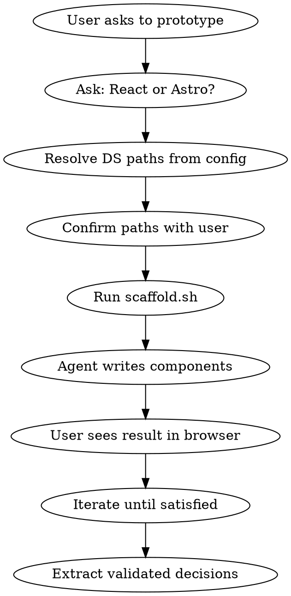

# jrp-ds-visual-prototyping

Rapid visual prototyping with the real joserprieto design system. Creates disposable mini-apps that
use the actual DS tokens, styles, sprite, and fonts via symlinks — changes to the DS are reflected
instantly.

## Prerequisites

- Node.js >= 20
- pnpm installed globally
- The joserprieto DS built (`pnpm build` in jrp-ui)

## Workflow



### Step 1 — Choose framework

Ask the user:

> **React or Astro?**
>
> - **React** — Fast interactive prototyping (state, FLIP animations, toggles, dynamic UI)
> - **Astro** — Real DS component prototyping (exact production rendering with actual .astro
>   components)

### Step 2 — Resolve and confirm DS paths

Read `config.default.yaml` from this skill directory. If `config.local.yaml` exists, merge it (local
overrides default). Expand `~` to the user's home directory.

Verify each path exists. Present to user:

```
Found DS at: {ds.root}
  Tokens:     {ds.tokens}     [OK/MISSING]
  Styles:     {ds.styles}     [OK/MISSING]
  Sprite:     {ds.sprite}     [OK/MISSING]
  Fonts:      {ds.fonts}      [OK/MISSING]
  Components: {ds.components} [OK/MISSING] (Astro only)

Output: {output}
Is this correct? (y/n)
```

If any path is MISSING, help the user fix it or create `config.local.yaml` with overrides.

### Step 3 — Scaffold the mini-app

Run `scaffold.sh` with the chosen framework:

```bash
bash scripts/scaffold.sh --type react|astro [--output /path] [--config /path/to/config.yaml]
```

The script:

1. Copies the template to the output directory
2. Creates symlinks to DS assets (tokens.css, main.css, sprite SVG, fonts)
3. Runs `pnpm install`
4. Starts the dev server in background
5. Prints the URL

### Step 4 — Write components

Write components in the mini-app using real DS classes:

**React example:**

```tsx
export function MyComponent() {
  return (
    <div className="jrp-ds-card" data-variant="elevated">
      <div className="jrp-ds-card__header">
        <h2 className="jrp-ds-heading" data-level="3">
          Title
        </h2>
      </div>
      <div className="jrp-ds-card__body">
        <span className="jrp-ds-chip" data-variant="primary">
          <span className="jrp-ds-chip__label">Tag</span>
        </span>
      </div>
    </div>
  );
}
```

**Astro example:**

```astro
---
import Card from '{ds.components}/atoms/Card.astro';
import Chip from '{ds.components}/atoms/Chip.astro';
---
<Card variant="elevated">
  <Chip variant="primary">Tag</Chip>
</Card>
```

### Step 5 — Iterate

- User reviews in browser, provides feedback
- Agent modifies components
- Vite HMR / Astro HMR reflects changes instantly

### Step 6 — Extract

Once satisfied, copy validated design decisions (component markup, class usage, layout patterns)
back to the main project.

## DS Class Reference (Quick)

| Component  | Class                  | Key data-\* attributes                       |
| ---------- | ---------------------- | -------------------------------------------- |
| Card       | `.jrp-ds-card`         | `data-variant`, `data-size`, `data-shape`    |
| Button     | `.jrp-ds-button`       | `data-variant`, `data-size`                  |
| Badge      | `.jrp-ds-badge`        | `data-variant`, `data-size`                  |
| Chip       | `.jrp-ds-chip`         | `data-variant`, `data-size`, `data-outlined` |
| Disclosure | `.jrp-ds-disclosure`   | `data-variant`, `data-trigger-position`      |
| Window     | `.jrp-ds-window`       | `data-state`, `data-mode`                    |
| Sidebar    | `.jrp-ds-sidebar-base` | `data-collapsed`, `data-position`            |

All components use `var(--jrp-ds-*)` semantic tokens. NEVER hardcode values.

## Ports

| Framework | Port Range | Avoids                                           |
| --------- | ---------- | ------------------------------------------------ |
| React     | 4900–4999  | showcase (4523), coming-soon (4580), site (4680) |
| Astro     | 5900–5999  | Same                                             |

## Rules

- **Symlinks, not copies** — DS assets stay current
- **Disposable by default** — `/tmp/jrp-proto-{timestamp}`
- **No contamination** — config lives in skill dir, not target project
- **Templates are minimal** — ~10 files each, no unnecessary deps
