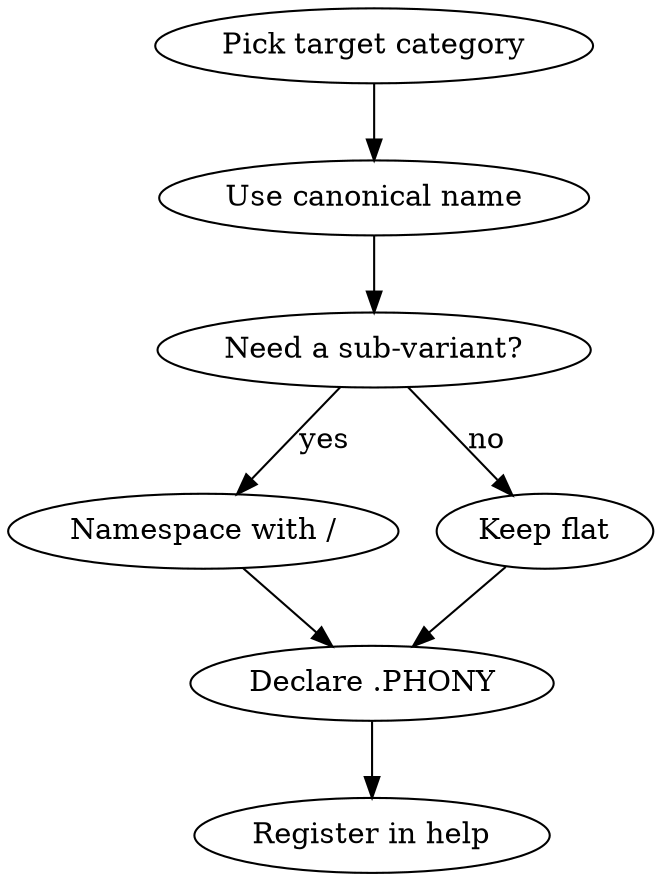

# Makefile Service Conventions

Canonical conventions for Makefiles that orchestrate local development services (dev servers,
previews, builds) across multi-project workspaces. Provides a predictable shape so every project
answers `make help` the same way, and so agents can drive any project with the same primitives.

## Core principle: Makefile as wrapper, not implementation

**The Makefile is an orchestrator, not where the logic lives.** It should NOT know:

- Which language runtime the project uses (`uv`, `pnpm`, `npm`, `go`, `cargo`)
- Which framework or server (`uvicorn`, `vite`, `next`, `express`)
- Framework-specific flags (`--host`, `--port`, `--reload`, `--log-level`)
- Any implementation detail of the work being done

**The Makefile SHOULD**:

- Expose canonical targets (`start`, `stop`, `test`, `build`, ...) that any contributor or AI agent
  can discover via `make help`
- Orchestrate lifecycle concerns (PID tracking, log management, background/foreground switching,
  dependency ordering between targets)
- Delegate the actual work to **scripts** living in `scripts/` (or equivalent: `bin/`, `tasks/`)

This is a direct application of the **GitHub "Scripts to Rule Them All"** pattern (2015) and the
**Facade Pattern** from Design Patterns (Gamma et al., 1994). For primary references, authoritative
quotes, and alternative tools (Taskfile, Just, cargo-make), see `references/bibliography.md`.

### Wrong (Makefile knows implementation)

```makefile
start:
	@uvicorn serve_app:app --host 127.0.0.1 --port 8000 --log-level info
```

The Makefile now depends on: uvicorn being installed, knowing that `--host` binds to loopback, the
specific log-level flag, and the ASGI app path. Changing from uvicorn to gunicorn requires editing
the Makefile.

### Right (Makefile wraps a script)

```makefile
start:
	@./scripts/serve
```

```bash
# scripts/serve (executable)
#!/usr/bin/env bash
set -euo pipefail
cd "$(dirname "$0")/.."
exec uv run uvicorn serve_app:app --host 127.0.0.1 --port "${PORT:-8000}" --log-level info
```

The Makefile now knows nothing specific. Switching to gunicorn or hypercorn means editing
`scripts/serve` alone. Contributors onboarding to the project read `scripts/serve` to see "how", and
`make help` to see "what".

### Benefits

- **Discoverability**: `make help` gives a stable menu. Works the same across projects with wildly
  different stacks.
- **Swap-friendly**: replace the underlying tool (uvicorn → gunicorn, pnpm → bun) without touching
  the orchestration layer.
- **Testable in isolation**: scripts can be run standalone for CI, containers, or ad-hoc debugging —
  without needing to invoke `make`.
- **Composable**: scripts can call each other (`scripts/start-all` invokes `scripts/start-backend`
  and `scripts/start-frontend`) — same way `script/setup` calls `script/bootstrap` in the GitHub
  convention.
- **AI-agent-friendly**: an agent only needs to know the canonical target names. The underlying
  stack is opaque to it.

### When a plain script isn't enough

For complex orchestration (N services with dependencies, log rotation, cross-cutting concerns), you
may need a higher-level service manager (TypeScript, Go, Python). That's still "scripts to rule them
all" — the service manager IS the script. The Makefile stays thin:

```makefile
SM := node --experimental-strip-types scripts/service-manager.ts

start: _ensure
	@$(SM) start

stop: _ensure
	@$(SM) stop --all
```

The Makefile still knows nothing about services or their implementation.

## Workflow



## Step 1: Canonical Target Names

These names are **reserved** — use them only with the intent described. If a project needs none of
them, omit the target rather than repurpose the name.

| Target        | Purpose                                      | Depends on       |
| ------------- | -------------------------------------------- | ---------------- |
| `help`        | Print usage with target list and examples    | (none — default) |
| `install`     | Install project dependencies (alias: `deps`) | —                |
| `deps`        | Install dependencies (primary name)          | —                |
| `build`       | Full production build                        | `deps`           |
| `start`       | Start long-running dev service (background)  | `deps`           |
| `start/fg`    | Same as `start` but runs in the foreground   | `deps`           |
| `stop`        | Stop running service                         | —                |
| `restart`     | Stop + start                                 | —                |
| `status`      | Show service status (PIDs, ports, URLs)      | —                |
| `logs`        | List log files with size                     | —                |
| `logs/follow` | Follow (tail -f) all service logs            | —                |
| `test`        | Run test suite                               | `deps`           |
| `ci`          | Run CI-equivalent locally                    | `deps`           |
| `lint`        | Run all linters                              | `deps`           |
| `lint/fix`    | Auto-fix lint issues                         | `deps`           |
| `format`      | Format files                                 | `deps`           |
| `clean`       | Remove build artifacts                       | —                |
| `release`     | Create release (ARGS=patch\|minor\|major)    | —                |
| `ai`          | Sync AI agent context (symlinks, files)      | —                |

**Semantic naming for log commands**: `tail` is Unix jargon; prefer `logs/follow` for the canonical
target. The `logs` namespace groups all log-related targets (`logs`, `logs/follow`,
`logs/follow/<service>`, future `logs/rotate`, `logs/clear`, etc.).

**Background by default, `/fg` opt-in for foreground**: `start` and `start/<service>` arrange for
the process to run in the background (PID tracked in `.state/`, output captured in `.logs/`), so the
terminal is free. Adding `/fg` runs in the foreground — useful when you want stdout live or Ctrl-C
to stop cleanly.

**Primary vs alias**: `deps` is primary. `install` is an alias. Projects that don't need both can
keep only `deps`.

## Step 2: Namespacing With `/`

When a target has variants, split with `/` instead of inventing new names.

```makefile
start           # start default service
start/preview   # start build + preview server
stop            # stop default
stop/all        # stop every managed service
stop/preview    # stop preview server only
restart/preview # restart preview
lint/md         # lint markdown only
lint/md/fix     # auto-fix markdown lint
```

**Rules:**

- The prefix is a canonical name from Step 1 (`start`, `stop`, `lint`, etc.)
- The suffix is a noun or qualifier (`preview`, `all`, `md`, `shell`)
- Max two levels (`lint/md/fix` is the upper bound; `lint/md/fix/strict` is a smell — split the
  concern elsewhere)

## Step 3: Help as `.DEFAULT_GOAL`

Running `make` with no argument must print help. This means `help` is the first visible target AND
is declared as `.DEFAULT_GOAL`.

```makefile
SHELL := /bin/bash
.SHELLFLAGS := -euo pipefail -c
.DEFAULT_GOAL := help
MAKEFLAGS += --no-print-directory

PROJECT := My Service
VERSION := $(shell cat .semver 2>/dev/null || echo "0.1.0")

# ── Colors (POSIX-safe via printf) ───────────────────────

GREEN := $(shell printf '\033[0;32m')
BLUE  := $(shell printf '\033[0;34m')
RED   := $(shell printf '\033[0;31m')
CYAN  := $(shell printf '\033[0;36m')
BOLD  := $(shell printf '\033[1m')
RESET := $(shell printf '\033[0m')

help: ## Show this help
	@printf "$(BOLD)$(CYAN)%s$(RESET) v%s\n\n" "$(PROJECT)" "$(VERSION)"
	@printf "$(BOLD)Usage:$(RESET) make <target> [ARGS=...]\n\n"
	@printf "  $(GREEN)start$(RESET)          Start dev server\n"
	@printf "  $(GREEN)start/preview$(RESET)  Build + serve preview\n"
	@printf "  $(GREEN)stop$(RESET)           Stop service\n"
	@printf "  $(GREEN)restart$(RESET)        Restart service\n"
	@printf "  $(GREEN)status$(RESET)         Show status\n"
	@printf "  $(GREEN)build$(RESET)          Production build\n"
	@printf "  $(GREEN)deps$(RESET)           Install dependencies\n"
	@printf "  $(GREEN)test$(RESET)           Run tests\n"
	@printf "  $(GREEN)clean$(RESET)          Remove build artifacts\n\n"
```

**Why `printf` and not `echo -e`**: `echo -e` is not POSIX and differs between GNU and BSD. `printf`
is portable.

## Step 4: `.env.local` Integration

Projects that have local configuration (ports, profile flags, portless names) load them via
`-include`. The leading `-` means "don't fail if missing".

```makefile
# ── Environment ──────────────────────────────────────────

-include .env.local
export PORTLESS_APP_DEV PORTLESS_APP_PREVIEW
export PROFILE APP
```

**File roles:**

| File           | Purpose                          | In git?     |
| -------------- | -------------------------------- | ----------- |
| `.env.example` | Template with variable names     | Yes         |
| `.env.local`   | Real local values (ports, names) | No (ignore) |
| `.env`         | Non-secret defaults (rare)       | Sometimes   |

Add `.env.local` to `.gitignore`. Ship `.env.example` with the variable names and inline comments
explaining each.

## Step 5: `PROFILE` and `APP` Variables

Two common axes of variation:

- **`PROFILE`**: which feature/content set (`development`, `production`, `staging`, `preview`)
- **`APP`**: which sub-application (when a monorepo exposes multiple)

```makefile
APP     ?= ps         # default app short-code
PROFILE ?= development
ARGS    ?=            # passthrough to underlying command

start: ## Start dev server
	@cd src/apps/$(APP) && APP_PROFILE=$(PROFILE) pnpm dev $(ARGS)
```

Invocation:

```bash
make start                         # APP=ps, PROFILE=development
make start PROFILE=production       # different profile, same app
make start APP=sc PROFILE=staging   # different app + profile
make start ARGS=--verbose           # passthrough extra args
```

**Rule**: use `?=` for overridable defaults. Use `:=` for values derived once from the environment
(e.g., `ROOT_DIR := $(shell pwd)`).

## Step 6: `.PHONY` Declaration

Every non-file target must be declared `.PHONY` to prevent accidental matches with files of the same
name. Group them in one block near the top.

```makefile
.PHONY: help install deps build start start/preview stop stop/all restart
.PHONY: restart/preview status log tail test ci lint lint/fix format clean
.PHONY: release ai
.PHONY: _ensure_deps _ensure_dirs
```

Internal helpers start with `_` and are also `.PHONY`. They are invoked as prerequisites only, not
by the user directly.

## Step 7: Ensure-Deps Pattern

Don't let targets fail with cryptic errors when a required tool is missing. Use `_ensure_deps` as a
prerequisite.

```makefile
_ensure_deps:
	@command -v pnpm >/dev/null || { printf "$(RED)pnpm required$(RESET)\n"; exit 1; }
	@command -v node >/dev/null || { printf "$(RED)node required$(RESET)\n"; exit 1; }

_ensure_dirs:
	@mkdir -p $(STATE_DIR) $(LOGS_DIR)

start: _ensure_deps _ensure_dirs ## Start dev server
	@$(SM) start $(SVC_START) $(ARGS)
```

### Trap: `set -e` + commands that return non-zero "legitimately"

With `.SHELLFLAGS := -euo pipefail -c`, any command exiting non-zero aborts the target — **including
commands that signal "nothing to do" via non-zero exit**. The most common offender is `lsof`:

```bash
lsof -tiTCP:$(PORT) -sTCP:LISTEN   # returns 1 when nothing listens
grep -q pattern file                # returns 1 when no match
pgrep myprocess                     # returns 1 when no process
```

All three are useful inside `_kill_port` / `_stop_all` / similar helpers — and all three will kill
your target under `set -e` if the "no result" case happens. Fix: append `|| true`:

```makefile
# Bad (aborts when port is free)
_kill_port:
	@pid=$$(lsof -tiTCP:$(PORT) -sTCP:LISTEN 2>/dev/null); \
	if [ -n "$$pid" ]; then kill $$pid; fi

# Good (handles the "nothing listening" case)
_kill_port:
	@pid=$$(lsof -tiTCP:$(PORT) -sTCP:LISTEN 2>/dev/null || true); \
	if [ -n "$$pid" ]; then \
		kill $$pid 2>/dev/null || true; \
		printf "$(YELLOW)Killed process on port $(PORT)$(RESET)\n"; \
	fi
```

Note that `2>/dev/null` silences stderr but **does not change the exit code**. `|| true` is what
preserves `set -e` for real errors while tolerating "empty result" exits.

**Alternative** for broader tolerance, scope `set +e` locally:

```makefile
_kill_port:
	@set +e; \
	pid=$$(lsof -tiTCP:$(PORT) -sTCP:LISTEN 2>/dev/null); \
	set -e; \
	if [ -n "$$pid" ]; then kill $$pid; fi
```

But `|| true` per command is cleaner — fails safer on actual errors.

## Step 8: Minimal Canonical Template

For a project that doesn't need the full service manager machinery (a simple static site or a single
Python module), a short Makefile suffices. Keep the canonical names even for trivial projects —
consistency is the point.

```makefile
SHELL := /bin/bash
.SHELLFLAGS := -euo pipefail -c
.DEFAULT_GOAL := help
MAKEFLAGS += --no-print-directory

PROJECT := Minimal Example
VERSION := 0.1.0

GREEN := $(shell printf '\033[0;32m')
BOLD  := $(shell printf '\033[1m')
CYAN  := $(shell printf '\033[0;36m')
RESET := $(shell printf '\033[0m')

-include .env.local

.PHONY: help install deps build start stop test clean

help:
	@printf "$(BOLD)$(CYAN)%s$(RESET) v%s\n\n" "$(PROJECT)" "$(VERSION)"
	@printf "  $(GREEN)start$(RESET)    Start service\n"
	@printf "  $(GREEN)stop$(RESET)     Stop service\n"
	@printf "  $(GREEN)test$(RESET)     Run tests\n"
	@printf "  $(GREEN)build$(RESET)    Build\n"
	@printf "  $(GREEN)deps$(RESET)     Install deps\n"
	@printf "  $(GREEN)clean$(RESET)    Clean artifacts\n\n"

deps:
	@uv sync

install: deps

build:
	@uv run python -m build

start:
	@uv run python app.py

stop:
	@pkill -f "python app.py" || true

test:
	@uv run pytest

clean:
	@rm -rf dist/ build/ .pytest_cache/
```

## Common Mistakes

| Mistake                                   | Correct Approach                                                 |
| ----------------------------------------- | ---------------------------------------------------------------- |
| Naming `dev` or `run` instead of `start`  | Use canonical `start`                                            |
| `start-preview` with hyphen               | Use `/` namespacing: `start/preview`                             |
| Forgetting `.PHONY`                       | Every non-file target must be `.PHONY`                           |
| Hardcoding values that change per machine | Load from `.env.local` with `-include`                           |
| Committing `.env.local`                   | Add to `.gitignore`; ship `.env.example`                         |
| Using `echo -e` for colors                | Use `printf` (POSIX-safe)                                        |
| `help` not as `.DEFAULT_GOAL`             | `.DEFAULT_GOAL := help` so `make` alone shows help               |
| `install` without `deps` alias            | Provide `deps` as primary, `install` as alias if common in stack |
| Mixing service lifecycle and build in one | `start` ≠ `build`. `start/preview` depends on `build`, not IS it |
| Deep namespacing (`lint/md/fix/strict`)   | Max two levels. Split concerns via separate targets or `ARGS`    |

## Integrating with portless (no abstraction layer needed)

Portless integrates directly with these conventions. **You do NOT need a `service-manager.ts` or
similar orchestrator** to use portless — plain `portless <name> <cmd>` as the target command works:

```makefile
start: _ensure_deps
	@portless dev.myapp.myorg vite

start/backend: _ensure_deps
	@portless api.myapp.myorg go run ./cmd/server

start/dashboard: _ensure_deps
	@portless dashboard.myapp.myorg \
		sh -c 'exec uv run uvicorn serve_app:app --host 127.0.0.1 --port "$$PORT"'
```

A service-manager abstraction is useful when you have many services with cross-dependencies, PID
tracking across sessions, log rotation, or need consistent background/foreground UX. For 1-3
services, direct `portless` calls are simpler. See `portless-service-integration` skill for full
patterns (including ecosystem-specific references for Python, Node, Go).

## Related Skills

- `portless-service-integration` — for `start` targets that need stable `.localhost` URLs instead of
  port numbers. Covers Python (uvicorn), Node (Vite, Storybook, Next), and Go specifically.
- `service-manager` — optional higher-level orchestrator for projects with multiple long-running
  services that need PID tracking and log rotation
- `repo-kickstart` — for projects scaffolded from scratch that need the whole toolchain
  (lint/format/release) wired to these conventions

## On-demand references

- `references/bibliography.md` — authoritative sources for the patterns in this skill (Scripts to
  Rule Them All, Facade Pattern, Taskfile, Just, POSIX Make, GNU Make manual, further reading). Load
  when onboarding a new contributor, writing a blog post, or defending a design choice in review.
