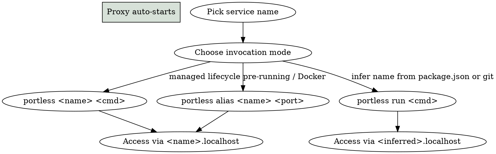

# Portless Service Integration

`portless` (npm package) replaces port numbers with stable `.localhost` URLs. Instead of memorizing
`localhost:5173` vs `localhost:4321` vs `localhost:8765`, each service gets a named URL like
`dev.ps.myorg.localhost`. Same URL across restarts, profiles, and machines.

**Value proposition:**

- Zero port conflicts across projects
- Stable URLs in bookmarks, docs, and `.env` files
- Cookies and localStorage isolated per service (no clashes at `localhost:X`)
- HTTPS with HTTP/2 out of the box (via local CA)
- Language-agnostic (works with any process that speaks HTTP on a TCP port)

This skill is deliberately **ecosystem-agnostic**. Load an ecosystem-specific reference for concrete
patterns:

- `references/python-uvicorn.md` — Python ASGI servers (uvicorn + starlette, aiohttp). **Do NOT use
  `python -m http.server` behind portless** — see reference for why.
- `references/vite-storybook.md` — Vite, Storybook, Astro, Next, and other Node frameworks where
  portless auto-injects `--port`/`--host`.
- `references/go-net-http.md` — Go `net/http` services (stdlib is HTTP/1.1 keep-alive by default).

## Workflow



## Step 1: Proxy setup (auto-starts, rarely manual)

Portless runs a background proxy that binds `.localhost` → your ports. It **auto-starts** the first
time you run `portless <name> <cmd>` or `portless run <cmd>`. Manual start is only needed for
specific scenarios.

```bash
# Start HTTPS proxy on port 443 (requires sudo first time — installs local CA)
portless proxy start

# HTTP-only on port 80 (no sudo, no TLS)
portless proxy start --no-tls

# Custom proxy port (no sudo, no special privileges)
portless proxy start -p 1355

# Foreground for debugging
portless proxy start --foreground

# Stop proxy
portless proxy stop
```

**Do NOT write proxy-alive checks in Makefiles** before invoking `portless <name> <cmd>` — the
command itself handles auto-start. Checks like `lsof -iTCP:443 -sTCP:LISTEN` are unreliable because
privileged port owners may not be visible without root, and return false negatives.

## Step 2: Naming convention (with optional tenant tag)

```text
{mode}.{profile-initial}.{app}.{tenant}.localhost
```

- `mode`: `dev`, `preview`, `build`, `serve`, `dashboard`, ...
- `profile-initial`: `d` (development), `p` (production), `s` (staging) — optional
- `app`: short code (`ps`, `sc`, `cp-analytics`, ...)
- `tenant`: optional namespace for your team/org (e.g. `myorg`, `acme`)

Examples (using `myorg` as the tenant tag):

- `dev.d.ps.myorg.localhost` — dev server, development profile, Personal Site
- `preview.p.ps.myorg.localhost` — preview, production profile, PS
- `dev.sc.myorg.localhost` — site components dev (no profile axis)
- `dashboard.cp-analytics.myorg.localhost` — analytics dashboard

Drop the tenant tag for single-org projects: `{mode}.{app}.localhost`.

## Step 3: Env vars portless injects into child processes

When you run `portless <name> <cmd>`, portless sets these env vars for the child:

- **`PORT`** — ephemeral port (4000-4999 range) the child must listen on
- **`HOST`** — always `127.0.0.1` (IPv4). The proxy connects upstream to this address
- **`PORTLESS_URL`** — the public URL (e.g. `https://myapp.localhost`) for cross-service refs

**Upstream must bind to `127.0.0.1`** (IPv4 explicit). The docs are clear on this. If your server
binds to `localhost` and the OS resolves it to IPv6 (`::1`), portless can't reach it — you'll see
the TLS handshake fail with `SSL_ERROR_SYSCALL` at the proxy edge (proxy never logs the request).

### Does your tool respect `PORT` env var?

- **Yes (by convention)**: Next.js, Express, Nuxt, uvicorn (when you pass `--port "$PORT"`), most
  mature servers
- **No (portless auto-injects `--port` and `--host` flags)**: Vite, Astro, React Router, Angular,
  Expo, React Native
- **No (you must wire it yourself)**: `python -m http.server`, `ruby -run -e httpd`, any custom CLI

If your tool doesn't read `PORT` automatically, pass it explicitly:

```bash
portless myapp sh -c 'exec <tool> --port "$PORT" --host 127.0.0.1 ...'
```

## Step 4: Invocation modes

### Mode A — Managed lifecycle (most common)

```bash
portless dev.d.ps vite
# → https://dev.d.ps.myorg.localhost
# Portless assigns PORT, launches vite, registers route
```

### Mode B — Infer name from project

```bash
cd my-project
portless run vite
# → https://my-project.localhost (inferred from package.json or git root)
```

### Mode C — Static alias (pre-running services, Docker)

```bash
# Service already listens on a fixed port (e.g. PostgreSQL at 5432)
portless alias my-postgres 5432
# → https://my-postgres.localhost → 127.0.0.1:5432
```

Alias is for services **portless does not launch** (Docker, system services, already-running
processes). For services you want portless to manage, use Mode A.

### Mode D — Get URL for cross-service reference

```bash
BACKEND_URL=$(portless get backend)
# → https://backend.localhost
```

## Step 5: Wiring into Makefile or package.json

Portless composes with standard tooling. **No abstraction layer (like a service-manager.ts) is
required** — it's a plain CLI command you invoke.

### Directly in Makefile target

```makefile
serve: generate
	@portless dashboard.myapp <command>
```

### In `package.json`

```json
{
  "scripts": {
    "dev": "portless run vite"
  }
}
```

Then `pnpm dev` gets the portless URL without config duplication.

### Bypass portless for CI / scripted runs

```bash
PORTLESS=0 pnpm dev     # runs command directly on its default port
```

## Step 6: DNS resolution — `.localhost` auto-resolves

Modern macOS, Linux, and Windows resolve `*.localhost` to `127.0.0.1` automatically per **RFC
6761**. No `/etc/hosts` entries needed. This works out of the box with `curl`, `ping`, Chrome,
Firefox, Edge.

**Exceptions that may need `/etc/hosts` sync**:

- **Safari**: relies on system resolver and can miss certain subdomain configurations
- **Custom TLD** (`--tld test`): `.test` does not auto-resolve; portless auto-syncs `/etc/hosts`
  when you use it

Manual sync:

```bash
portless hosts sync    # Write current routes to /etc/hosts
portless hosts clean   # Remove portless entries from /etc/hosts
```

Environment flag to enable auto-sync for `.localhost`:

```bash
export PORTLESS_SYNC_HOSTS=1
```

## Step 7: Troubleshooting

### Cert stuck at 0 bytes (most common stuck state)

**Symptoms**:

- `curl` returns `LibreSSL SSL_connect: SSL_ERROR_SYSCALL`
- Proxy log (`/tmp/portless/proxy.log`) has no entry for the failed request (the TLS handshake dies
  before the proxy logs the upstream attempt)
- Other portless routes work fine

**Diagnosis**:

```bash
ls -la /tmp/portless/host-certs/ | grep <my-host>
```

If you see a `.pem` file with size `0`, portless failed to sign the CSR silently:

```text
-rw-r--r--  root  219  myapp_myorg_localhost-ext.cnf
-rw-------  root  227  myapp_myorg_localhost-key.pem
-rw-r--r--  root  391  myapp_myorg_localhost.csr
-rw-r--r--  root    0  myapp_myorg_localhost.pem    ← BUG: empty cert
```

**Fix** (quirúrgico):

```bash
# 1. Remove the corrupt cert files (owned by root, need sudo)
sudo rm /tmp/portless/host-certs/<my-host>*

# 2. Restart the proxy (regenerates certs on next request)
portless proxy stop
portless proxy start

# 3. Verify
curl -sS -I https://<my-host>.localhost/
# Expected: HTTP/2 200  +  x-portless: 1
```

**Impact of proxy restart**: all other active routes need their parent processes to re-run (they'll
re-register on next `portless <name> <cmd>`). If that's too disruptive, try step 1 alone first and
let portless regenerate on next request.

### Upstream reachable directly but not via proxy

If `curl http://127.0.0.1:<port>/` works but `curl https://<name>.localhost/` fails with
`SSL_ERROR_SYSCALL`, the issue is almost always the cert. See above.

### IPv4/IPv6 mismatch

If `portless list` shows `-> localhost:4321` and your upstream binds to `::1:4321` but portless
connects to `127.0.0.1:4321`, the upstream is unreachable. **Always bind upstreams to `127.0.0.1`
explicitly** — don't use `localhost` (which may resolve to `::1`) or `0.0.0.0` (works but exposes
the service on all interfaces).

### Proxy log location

```bash
/tmp/portless/proxy.log        # daemon log
/tmp/portless/host-certs/      # per-host certs
/tmp/portless/routes.json      # registered routes
/tmp/portless/ca.srl, ca.pem   # local CA
```

Tail during a failing request to capture the live error:

```bash
tail -f /tmp/portless/proxy.log &
curl https://<my-host>.localhost/
```

### Infinite loop between portless apps

If service A (e.g. Vite with `/api` proxy) forwards to service B without rewriting the `Host`
header, portless routes back to A → loop. Portless detects this and responds with
`508 Loop Detected`. Fix: in your frontend framework's proxy config, set `changeOrigin: true` (Vite,
webpack-dev-server).

## Common mistakes

| Mistake                                                      | Correct approach                                                  |
| ------------------------------------------------------------ | ----------------------------------------------------------------- |
| Bind upstream to `localhost` (may resolve to `::1`)          | Bind to `127.0.0.1` explicit                                      |
| Bind to `0.0.0.0` in dev                                     | Use `127.0.0.1` (matches portless + doesn't expose to LAN)        |
| Manual proxy-alive check in Makefile before `portless <cmd>` | Trust auto-start; portless handles it                             |
| Use `portless alias` for services you launch yourself        | Use `portless <name> <cmd>` (managed lifecycle)                   |
| Assume `.localhost` needs `/etc/hosts` entries               | Modern OS resolvers handle `*.localhost` per RFC 6761             |
| Wrap everything in `service-manager.ts` abstraction          | Direct `portless` calls in Makefile / package.json work fine      |
| Use `python -m http.server` behind portless                  | See `references/python-uvicorn.md` — use uvicorn instead          |
| Use `--no-tls` on :443 (http on :443)                        | Stick with default HTTPS on :443 for browser compat               |
| Ignore 0-byte cert files silently                            | Check `/tmp/portless/host-certs/` when TLS fails — fix per Step 7 |

## Related skills

- `makefile-service-conventions` — canonical Makefile targets (start, stop, serve, status) that wire
  into portless
- `service-manager` — optional higher-level orchestrator when you have many services with PID
  tracking needs (not required for portless use)
- `repo-kickstart` — bootstrap a new project with portless wired in

## Ecosystem-specific references

Load these on demand when working with a specific stack:

- Python servers: `references/python-uvicorn.md`
- Vite / Storybook / Node frameworks: `references/vite-storybook.md`
- Go services: `references/go-net-http.md`
