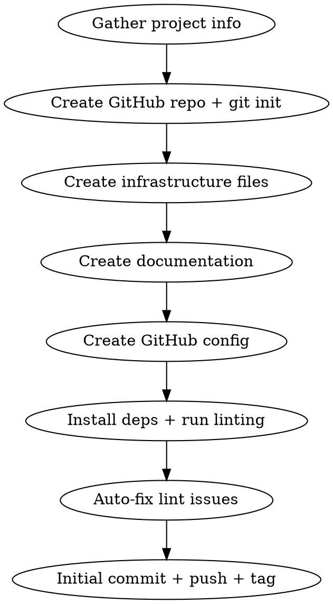

# Repo Kickstart

Set up a professional OSS-grade repository with CI/CD, linting, releases, and documentation.

## Prerequisites

The following tools must be installed before running this skill:

| Tool              | Min Version | Purpose                                             | Install                                                                                         |
| ----------------- | ----------- | --------------------------------------------------- | ----------------------------------------------------------------------------------------------- |
| Node.js           | >= 20       | commit-and-tag-version, markdownlint-cli2, prettier | macOS: `brew install node` or `nvm install 20`; Linux: `nvm install 20`; Windows: `nvm-windows` |
| shellcheck        | any         | Shell script linting                                | macOS: `brew install shellcheck`; Linux: `apt-get install shellcheck`                           |
| GNU Make          | any         | Task runner                                         | macOS: built-in; Linux: `apt-get install make`                                                  |
| GitHub CLI (`gh`) | any         | Repo creation, CI scripts                           | macOS: `brew install gh`; Linux: see [cli.github.com](https://cli.github.com/)                  |

## Workflow



### Step 1: Gather Project Info

> **Human Decision Point**
>
> Ask the user to provide the project parameters listed below.
>
> _Agent implementation: Use your platform's user interaction mechanism (e.g., AskUserQuestion in
> Claude Code, input prompts in Gemini CLI, UI dialogs in Cursor/VS Code)._

Collect from the user:

| Parameter         | Required | Default          |
| ----------------- | -------- | ---------------- |
| Project name      | Yes      | —                |
| Description       | Yes      | —                |
| GitHub owner/org  | Yes      | —                |
| GitHub visibility | No       | public           |
| License           | No       | MIT              |
| Tech stack        | No       | generic          |
| Contact email     | Yes      | git author email |

**Contact email:** This is the public email shown in `CODE_OF_CONDUCT.md` and `SECURITY.md`. Suggest
the git author email as default (`git config user.email`). This email MUST be obfuscated in all
committed files to prevent scraping (see [Data Leak Prevention](#data-leak-prevention)).

### Step 2: Create Repo + Git Init

```bash
mkdir -p /path/to/project
cd /path/to/project
git init
gh repo create owner/project-name --public \
  --description "..." --source=. --remote=origin
```

### Step 3: Create Files

**Directory structure:**

```
project/
├── .changelog-templates/     # Handlebars for auto-changelog
│   ├── template.hbs
│   ├── header.hbs
│   ├── commit.hbs
│   └── footer.hbs
├── docs/
│   └── conventions/           # Project conventions (from scaffold)
│       ├── build-tools.md
│       ├── changelog.md
│       ├── cicd.md
│       ├── commits.md
│       ├── dev-workflow.md
│       ├── releases.md
│       ├── testing.md
│       └── versioning.md
├── .github/
│   ├── config/labels.json    # Label definitions for sync
│   ├── ISSUE_TEMPLATE/
│   │   ├── bug_report.md
│   │   └── feature_request.md
│   ├── PULL_REQUEST_TEMPLATE.md
│   ├── dependabot.yml
│   ├── scripts/
│   │   ├── ci/
│   │   │   ├── on-failure.sh   # Create issue on CI failure
│   │   │   └── on-success.sh   # Close issue on CI success
│   │   └── issues/
│   │       ├── create.sh
│   │       ├── search.sh
│   │       ├── close.sh
│   │       └── lib/common.sh   # Shared logging + label constants
│   └── workflows/
│       ├── ci.yml              # Main CI with auto-issue management
│       ├── labels.yml          # Sync labels from labels.json
│       ├── release.yml         # (Optional) GitHub Release from tags
│       └── stale.yml           # (Optional) Close stale issues/PRs
├── .editorconfig
├── .gitignore
├── .gitlint                    # Conventional commits enforcement
├── .markdownlint-cli2.jsonc    # Markdown lint config + ignores
├── .prettierrc
├── .prettierignore
├── .semver                     # Plain-text version (starts at 0.0.0)
├── .versionrc.js               # commit-and-tag-version config
├── CHANGELOG.md
├── .githooks/
│   └── pre-commit              # Personal data leak detection
├── CODE_OF_CONDUCT.md          # Contributor Covenant 2.1
├── CONTRIBUTING.md
├── LICENSE
├── Makefile
├── README.md
├── ROADMAP.md
├── SECURITY.md
└── package.json                # Release + lint tooling only
```

> **Human Decision Point**
>
> Confirm the directory structure with the user before creating files.
>
> _Agent implementation: Use your platform's user interaction mechanism (e.g., AskUserQuestion in
> Claude Code, input prompts in Gemini CLI, UI dialogs in Cursor/VS Code)._

### Step 3b: Documentation and Community Files

Create all documentation and community files using the templates in `assets/templates/`. The agent
MUST use these templates verbatim — do not hallucinate content.

Placeholders used across all templates:

| Placeholder           | Source                                             |
| --------------------- | -------------------------------------------------- |
| `PROJECT_NAME`        | Step 1: Project name                               |
| `PROJECT_DESCRIPTION` | Step 1: Description                                |
| `GITHUB_OWNER`        | Step 1: GitHub owner/org                           |
| `CONTACT_EMAIL`       | Step 1: Contact email (obfuscated in output files) |

Create each file by reading the corresponding template below and replacing placeholders:

| Target file                                 | Template                                                                                       |
| ------------------------------------------- | ---------------------------------------------------------------------------------------------- |
| `.gitignore`                                | [assets/templates/gitignore.tpl](assets/templates/gitignore.tpl)                               |
| `.semver`                                   | [assets/templates/semver.tpl](assets/templates/semver.tpl)                                     |
| `CHANGELOG.md`                              | [assets/templates/changelog.md.tpl](assets/templates/changelog.md.tpl)                         |
| `LICENSE`                                   | [assets/templates/license-mit.tpl](assets/templates/license-mit.tpl)                           |
| `README.md`                                 | [assets/templates/readme.md.tpl](assets/templates/readme.md.tpl)                               |
| `ROADMAP.md`                                | [assets/templates/roadmap.md.tpl](assets/templates/roadmap.md.tpl)                             |
| `CONTRIBUTING.md`                           | [assets/templates/contributing.md.tpl](assets/templates/contributing.md.tpl)                   |
| `SECURITY.md`                               | [assets/templates/security.md.tpl](assets/templates/security.md.tpl)                           |
| `CODE_OF_CONDUCT.md`                        | [assets/templates/code-of-conduct.md.tpl](assets/templates/code-of-conduct.md.tpl)             |
| `.github/ISSUE_TEMPLATE/bug_report.md`      | [assets/templates/bug-report.md.tpl](assets/templates/bug-report.md.tpl)                       |
| `.github/ISSUE_TEMPLATE/feature_request.md` | [assets/templates/feature-request.md.tpl](assets/templates/feature-request.md.tpl)             |
| `.github/PULL_REQUEST_TEMPLATE.md`          | [assets/templates/pull-request-template.md.tpl](assets/templates/pull-request-template.md.tpl) |

> **Human Decision Point**
>
> Confirm license type (default: MIT) and copyright holder name with the user.
>
> _Agent implementation: Use your platform's user interaction mechanism (e.g., AskUserQuestion in
> Claude Code, input prompts in Gemini CLI, UI dialogs in Cursor/VS Code)._

Note: `CHANGELOG.md` MUST be empty (no header). `commit-and-tag-version` generates the header from
`config.header` in `.versionrc.js`. Having content in the file causes header duplication on every
release.

### Step 3c: Project Conventions (Scaffold)

Create the `docs/conventions/` directory with the project convention documents. These are generic
templates that apply to any project using this infrastructure.

Copy each file from the scaffold templates:

| Target file                         | Scaffold template                                                                                                |
| ----------------------------------- | ---------------------------------------------------------------------------------------------------------------- |
| `docs/conventions/versioning.md`    | [assets/scaffold/docs/conventions/versioning.md](assets/scaffold/docs/conventions/versioning.md)                 |
| `docs/conventions/commits.md`       | [assets/scaffold/docs/conventions/commits.md](assets/scaffold/docs/conventions/commits.md)                       |
| `docs/conventions/changelog.md`     | [assets/scaffold/docs/conventions/changelog.md](assets/scaffold/docs/conventions/changelog.md)                   |
| `docs/conventions/releases.md`      | [assets/scaffold/docs/conventions/releases.md](assets/scaffold/docs/conventions/releases.md)                     |
| `docs/conventions/build-tools.md`   | [assets/scaffold/docs/conventions/build-tools.md](assets/scaffold/docs/conventions/build-tools.md)               |
| `docs/conventions/dev-workflow.md`  | [assets/scaffold/docs/conventions/dev-workflow.md](assets/scaffold/docs/conventions/dev-workflow.md)              |
| `docs/conventions/cicd.md`          | [assets/scaffold/docs/conventions/cicd.md](assets/scaffold/docs/conventions/cicd.md)                             |
| `docs/conventions/testing.md`       | [assets/scaffold/docs/conventions/testing.md](assets/scaffold/docs/conventions/testing.md)                       |

After copying, customize:

- **`commits.md`**: Replace example scopes with project-specific scopes
- **`cicd.md`**: Remove the GitHub Actions section if not using GitHub; add platform-specific
  section for GitLab CI, Jenkins, etc.
- **`testing.md`**: Add project-specific test commands and framework details

### Step 4: Key Configuration Patterns

Create each configuration file using the templates in `assets/configs/`. These files control
linting, formatting, versioning, and changelog generation.

| Target file                | Template                                                                       |
| -------------------------- | ------------------------------------------------------------------------------ |
| `package.json`             | [assets/configs/package-json.md](assets/configs/package-json.md)               |
| `.markdownlint-cli2.jsonc` | [assets/configs/markdownlint-cli2.md](assets/configs/markdownlint-cli2.md)     |
| `.versionrc.js`            | [assets/configs/versionrc.md](assets/configs/versionrc.md)                     |
| `.changelog-templates/`    | [assets/configs/changelog-templates.md](assets/configs/changelog-templates.md) |
| `.prettierrc`              | [assets/configs/prettierrc.md](assets/configs/prettierrc.md)                   |
| `.prettierignore`          | [assets/configs/prettierignore.md](assets/configs/prettierignore.md)           |
| `.editorconfig`            | [assets/configs/editorconfig.md](assets/configs/editorconfig.md)               |
| `.gitlint`                 | [assets/configs/gitlint.md](assets/configs/gitlint.md)                         |

For context on how these tools work together, see
[references/release-pipeline.md](references/release-pipeline.md).

### Step 5: CI/CD — Self-Healing Pipeline

The CI system has 3 layers: **labels** (prerequisite), **issue management scripts** (reusable
library), and the **CI workflow** (orchestrator). All shell scripts use a shared library for logging
and constants.

Create each CI component by reading the corresponding reference:

| Component                           | Reference                                                                      |
| ----------------------------------- | ------------------------------------------------------------------------------ |
| Labels config + sync workflow       | [assets/ci/labels.md](assets/ci/labels.md)                                     |
| Issue management library            | [assets/ci/issue-management-library.md](assets/ci/issue-management-library.md) |
| CI auto-issue scripts               | [assets/ci/auto-issue-scripts.md](assets/ci/auto-issue-scripts.md)             |
| CI workflow                         | [assets/ci/workflow.md](assets/ci/workflow.md)                                 |
| Dependabot                          | [assets/ci/dependabot.md](assets/ci/dependabot.md)                             |
| Optional workflows (release, stale) | [assets/ci/optional-workflows.md](assets/ci/optional-workflows.md)             |

**IMPORTANT:** Labels MUST exist before CI can tag issues. Always run the labels sync workflow
first.

#### 5.5 Adapting to Your Project

To add/remove CI jobs, follow this pattern:

1. Add the job to the `jobs:` section (parallel with others)
2. Add it to `ci-summary.needs: [...]`
3. Add env var + output in `Determine overall result` step
4. Add the env var to the `if` condition in `Determine overall result`
5. Add a row in `Print summary`
6. Add a `Handle X failure` step and a `Handle X success` step
7. Add a `job:your-job-name` label to `labels.json`

> **🔄 Human Decision Point**
>
> Present CI/CD options to the user and confirm which optional workflows to include.
>
> _Agent implementation: Use your platform's user interaction mechanism (e.g., AskUserQuestion in
> Claude Code, input prompts in Gemini CLI, UI dialogs in Cursor/VS Code)._

### Step 6: Makefile

The Makefile is the project's command center. All developer operations go through `make` targets.

Create the Makefile using the template in
[assets/templates/makefile.tpl.md](assets/templates/makefile.tpl.md).

Replace `PROJECT_NAME_HERE` and `PROJECT_DESCRIPTION_HERE` with the values from Step 1.

### Step 7: Linting Checklist

After creating all files:

1. `npm install`
2. `npx markdownlint-cli2 '**/*.md'` — fix issues with `--fix`
3. `shellcheck --severity=warning -x .github/scripts/**/*.sh`
4. `npx prettier --check '**/*.{md,json,yml,yaml}'` — fix with `--write`
5. Make shell scripts executable: `chmod +x .github/scripts/**/*.sh`

> **🔄 Human Decision Point**
>
> Present lint results to the user and confirm all issues are resolved before committing.
>
> _Agent implementation: Use your platform's user interaction mechanism (e.g., AskUserQuestion in
> Claude Code, input prompts in Gemini CLI, UI dialogs in Cursor/VS Code)._

### Step 8: Initial Commit + First Release

> **🔄 Human Decision Point**
>
> Show the user the list of files to be committed and get confirmation before pushing.
>
> _Agent implementation: Use your platform's user interaction mechanism (e.g., AskUserQuestion in
> Claude Code, input prompts in Gemini CLI, UI dialogs in Cursor/VS Code)._

**IMPORTANT:** The initial commit MUST have all versions at `0.0.0` (`.semver`, `Makefile`, and any
extra bump files like `pyproject.toml`). The `CHANGELOG.md` MUST be empty (no header — the tool
generates it from `config.header` in `.versionrc.js`).

#### Step 8a: Initial commit (version 0.0.0)

```bash
git add [all files explicitly]
git commit -m "feat: initial project infrastructure

Repository setup with CI/CD, linting, releases, and documentation."
```

#### Step 8b: First release (0.0.0 → 0.1.0)

Use the release tooling — do NOT create the tag manually:

```bash
make release/first
```

This runs `commit-and-tag-version --release-as minor --skip.commit --skip.tag`, which:

1. Bumps `.semver`, `Makefile` (and `pyproject.toml` if configured) from `0.0.0` to `0.1.0`
2. Generates `CHANGELOG.md` with all commits since the beginning
3. Creates a `chore(release): v0.1.0` commit
4. Creates an annotated `v0.1.0` tag

**Do NOT use `--first-release`** — it skips the version bump and stays at `0.0.0`.

#### Step 8c: Enrich the CHANGELOG

The auto-generated CHANGELOG only contains commit subjects. Enrich it with descriptive content
following [Keep a Changelog](https://keepachangelog.com/) format, then amend:

```bash
# Edit CHANGELOG.md — add rich descriptions under each section
git add CHANGELOG.md
git commit --amend --no-edit
# Recreate the tag on the amended commit
git tag -d v0.1.0
git tag -a v0.1.0 -m "chore(release): v0.1.0"
```

#### Step 8d: Push

```bash
git push -u origin main --tags
```

## Data Leak Prevention

OSS repos MUST NOT contain personal data beyond the designated contact email. See
[references/data-leak-prevention.md](references/data-leak-prevention.md) for the complete guide
covering email obfuscation, pre-commit hooks, history purge, and `.gitignore` patterns.

## Common Mistakes

| Mistake                                | Fix                                                                   |
| -------------------------------------- | --------------------------------------------------------------------- |
| markdownlint scans node_modules        | Use `.markdownlint-cli2.jsonc` with `ignores` array                   |
| shellcheck fails on dynamic `source`   | `--severity=warning` in Makefile AND `severity: warning` in CI action |
| prettier reformats CHANGELOG           | Add `CHANGELOG.md` to `.prettierignore`                               |
| CI workflow interpolates user input    | Always use `env:` variables, never direct `${{ }}` in `run:`          |
| commit-and-tag-version fails on commit | Use `--skip.commit --skip.tag`, then commit manually                  |
| `.semver` needs trailing newline       | Some tools strip it; configure `end-of-file-fixer` to exclude         |
| Personal email in CODE_OF_CONDUCT      | Use obfuscated format: `hi [at] example [dot] com`                    |
| Personal data in git history           | `git rm` only removes from HEAD; use `git filter-repo` to purge       |
| Personal paths in examples             | Use generic paths (`~/Projects/...`) not real usernames               |
| Squash doesn't purge history           | Squash only rewrites HEAD chain; old refs survive in reflog/remotes   |
| `.gitkeep` for empty directories       | Use `.gitignore` with `*` + `!.gitignore` — protects against leaks    |
| Dependabot PRs have no labels          | Labels must pre-exist in the repo; sync `labels.json` first           |
| CI auto-close doesn't find issues      | Missing `job:*` labels; run labels sync workflow before first CI run  |
| Content filter blocks file creation    | Use `cp` + `sed` for CoC/Security files — never generate through model |
| `--first-release` keeps version 0.0.0 | Use `--release-as minor` for first release; `--first-release` skips bump |
| CHANGELOG header duplicated            | Start with empty `CHANGELOG.md`; `config.header` in `.versionrc.js` adds it |
| `pyproject.toml` not bumped            | `writeVersion` regex needs `/m` (multiline) flag; `version =` is not at BOF |
| `RELEASE_FILES` missing bump targets   | Every file in `bumpFiles` must also appear in `RELEASE_FILES` in Makefile |
| Manual `git tag` instead of `make`     | Always use `make release/*` — manual tags skip CHANGELOG + version bumps |

## Content Filtering — Template Files with Sensitive Language

**CRITICAL**: Some template files contain language that triggers API content filtering (e.g., Code of
Conduct mentions "harassment", "sexual", "ban"). When AI agents attempt to generate this content, the
entire output gets blocked — including other legitimate files in the same batch.

### Affected Files

- `CODE_OF_CONDUCT.md` (Contributor Covenant — contains harassment/discrimination language)
- `SECURITY.md` (may trigger on vulnerability/exploit terminology)
- Any file with anti-harassment policies or enforcement guidelines

### Required Approach

**NEVER generate these files' content through the model.** Instead, use shell-level copy + substitution:

```bash
# Copy template and replace placeholders with sed
sed -e 's/CONTACT_EMAIL/hi [at] example [dot] com/g' \
    -e 's/PROJECT_NAME/my-project/g' \
    assets/templates/code-of-conduct.md.tpl > CODE_OF_CONDUCT.md
```

### For Subagents/Teammates

When dispatching agents to create repo files, explicitly instruct them:

- Use `cp` + `sed` for CoC, Security, and any policy files
- Never read template content into the model's context and re-emit it
- Create these files in a SEPARATE step from other files to avoid batch failures
